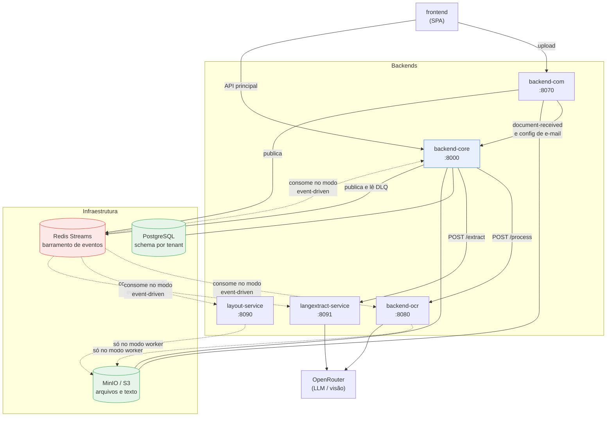

# DocuParse — Arquitetura dos Backends, Relacionamentos e Papel do Redis

> **Documentação técnica.** Descreve cada backend, suas dependências, os contratos de integração
> entre eles e, em detalhe, o papel do Redis em cada serviço.
>
> **Atualizado em:** 2026-07-28 · **Base:** branch `015-superlogica-discovery-spike`
>
> **Documentos relacionados:**
> - [fluxo-aplicacao.md](../workflow/fluxo-aplicacao.md) — o fluxo do documento ponta a ponta, etapa por etapa.
> - [backends-explicado.md](backends-explicado.md) — versão didática deste documento, sem jargão.
> - `docuparse-project/docs/TECHNICAL.md` — referência de endpoints e stack por componente.

---

## Índice

1. [Inventário de serviços](#1-inventário-de-serviços)
2. [Princípios de desenho](#2-princípios-de-desenho)
3. [Ficha de cada backend](#3-ficha-de-cada-backend)
4. [Mapa de relacionamentos e matriz de dependências](#4-mapa-de-relacionamentos-e-matriz-de-dependências)
5. [Contratos de integração](#5-contratos-de-integração)
6. [O papel do Redis](#6-o-papel-do-redis)
7. [Modos de operação](#7-modos-de-operação)
8. [Matriz de falhas](#8-matriz-de-falhas)
9. [Configuração por serviço](#9-configuração-por-serviço)
10. [Notas sobre o estado atual](#10-notas-sobre-o-estado-atual)
11. [Verificação — como estas afirmações foram checadas](#11-verificação--como-estas-afirmações-foram-checadas)

---

## 1. Inventário de serviços

| Serviço | Stack | Porta | Estado | Papel |
|---|---|---|---|---|
| **backend-core** | Django 5 + DRF | 8000 | **Stateful** (PostgreSQL) | Orquestrador e dono do estado. Auth, multi-tenancy, documentos, schemas, validação, DLQ |
| **backend-com** | FastAPI | 8070 | Stateless | Captura de documentos: upload manual, e-mail (IMAP/webhook), WhatsApp (Twilio) |
| **backend-ocr** | FastAPI | 8080 | Stateless | Classifica o arquivo, escolhe o engine de OCR e devolve o texto bruto |
| **langextract-service** | FastAPI | 8091 | Stateless | Extrai campos estruturados do texto via LLM, guiado por um schema |
| **layout-service** | FastAPI | 8090 | Stateless | Classifica o layout do documento por heurística sobre o texto |
| *camunda-workers* | pyzeebe | — | Stateless | Orquestração BPMN alternativa (perfil opcional `camunda`) |

**Infraestrutura:** PostgreSQL 16 (5432) · Redis 7 (6380→6379) · MinIO (portas do host
configuráveis por `MINIO_API_PORT`/`MINIO_CONSOLE_PORT`; internamente sempre 9000/9001).

**Bibliotecas compartilhadas** (montadas em todos os serviços via `PYTHONPATH`, não são serviços):

| Pacote | Responsabilidade |
|---|---|
| `contracts/events` | Contratos Pydantic dos eventos de domínio — a fonte da verdade dos payloads |
| `shared/docuparse_storage` | Storage único (local/S3), chaves canônicas, roteamento por esquema de URI |
| `shared/docuparse_events` | Abstração do barramento de eventos (JSONL local ou Redis Streams) e DLQ |
| `shared/docuparse_observability` | Logging estruturado (`log_event`) |

---

## 2. Princípios de desenho

1. **Um único dono do estado.** Apenas o `backend-core` escreve no banco. Todos os demais backends são stateless: recebem entrada, devolvem saída e não guardam nada entre requisições.
2. **Arquivos não trafegam entre serviços por HTTP mais de uma vez.** O binário é gravado no storage compartilhado na captura; a partir daí os serviços trocam **URIs**, não bytes. A exceção é a chamada `backend-core → backend-ocr`, que reenvia o arquivo em multipart.
3. **Dois canais de integração:** HTTP síncrono (comando direto, com resposta) e eventos (notificação assíncrona). Os mesmos passos lógicos existem nos dois canais — ver §7.
4. **Contratos versionados.** Todo evento é validado contra um modelo Pydantic em `contracts/events`; um payload fora do contrato falha na borda do consumidor, não no meio do processamento.
5. **Falha não silenciosa.** Cada serviço registra a falha onde ela é observável: o core em `document.metadata` e no log estruturado; os workers na DLQ.

---

## 3. Ficha de cada backend

### 3.1 backend-core (Django, 8000)

| Aspecto | Detalhe |
|---|---|
| **Responsabilidade** | Orquestrar o pipeline e ser o dono exclusivo do estado dos documentos |
| **Estado** | PostgreSQL com **um schema por tenant** (`django_tenants`). `users`, `tenants` e auth ficam no schema `public`; `documents` é por tenant |
| **Expõe** | API REST `/api/auth/*` (login, refresh, registro), `/api/admin/tenants/*`, `/api/ocr/*` (documentos, validação, schemas, configurações, DLQ, diagnóstico) |
| **Consome (HTTP)** | `backend-ocr` (`/api/v1/process`, `/api/v1/engines`) e `langextract-service` (`/api/v1/extract`) |
| **Recebe (HTTP)** | `backend-com` → `POST /api/ocr/events/document-received` e `GET /api/ocr/settings/email` |
| **Dependências obrigatórias** | PostgreSQL, storage (MinIO/S3 ou disco) |
| **Dependências condicionais** | backend-ocr e langextract-service (só no momento do processamento); Redis (publicação de eventos e endpoints de DLQ) |
| **Concorrência** | `ThreadPoolExecutor` com 2 threads (`DOCUPARSE_PROCESSING_WORKERS`) para OCR/extração em background. O tenant da conexão é **re-aplicado dentro da thread** |
| **Se cair** | O sistema inteiro para: nada é registrado, nada é visível, nenhuma decisão é gravada |

**Responsabilidades exclusivas:** autenticação e emissão de JWT (com a claim `tenant`), resolução do schema por requisição, máquina de estados do documento, versionamento de campos extraídos, seleção do schema de extração, exposição e reprocessamento da DLQ.

---

### 3.2 backend-com (FastAPI, 8070)

| Aspecto | Detalhe |
|---|---|
| **Responsabilidade** | Capturar documentos dos canais externos, validar o básico, persistir o binário e anunciar a chegada |
| **Estado** | Nenhum |
| **Expõe** | `POST /api/v1/documents/manual` · `/api/v1/email/{webhook,messages,poll}` · `/api/v1/whatsapp/{webhook,poll}` |
| **Consome (HTTP)** | `backend-core`: `POST /api/ocr/events/document-received` (**timeout de 2 s**) e `GET /api/ocr/settings/email` (configuração de IMAP) |
| **Dependências obrigatórias** | Storage compartilhado |
| **Dependências condicionais** | Redis (publicação de `document.received`), backend-core (sincronização), IMAP e Twilio (canais externos) |
| **Autenticação** | JWT do usuário (upload manual), assinatura HMAC (webhook de e-mail), token interno de serviço (polling) |
| **Se cair** | Nenhum documento novo entra — por nenhum dos três canais. O que já está no sistema continua processando normalmente |

**Fronteira importante:** o backend-com **não sabe o que é o documento**. Ele valida canal, nome, tamanho e `content_type` (allowlist: PDF, JPEG, PNG, TIFF, WEBP), grava o original e anuncia. Toda interpretação vem depois.

**Ponto de atenção:** o `tenant_slug` extraído do JWT **sobrescreve** o `tenant_id` recebido no formulário — o cliente não escolhe o tenant de destino.

---

### 3.3 backend-ocr (FastAPI, 8080)

| Aspecto | Detalhe |
|---|---|
| **Responsabilidade** | Converter arquivo em texto: classificar, escolher o engine, executar e aplicar fallbacks |
| **Estado** | Nenhum |
| **Expõe** | `POST /api/v1/process` (multipart) · `GET /api/v1/engines` · `/health` · `/ready` |
| **Consome (HTTP)** | OpenRouter (engines de visão) e LlamaParse, conforme o engine escolhido |
| **Dependências obrigatórias** | Nenhuma interna |
| **Dependências condicionais** | OpenRouter (`OPENROUTER_API_KEY`/`OPENROUTER_MODEL` — sem eles o `/ready` responde **503**); storage e Redis **apenas** quando roda como worker de eventos |
| **Modos de execução** | (a) API síncrona chamada pelo core; (b) worker de eventos consumindo `document.received` |
| **Se cair** | Documentos entram e ficam em `RECEIVED`, sem texto. Nada é perdido: basta reprocessar |

**Decisões internas:** classificação em `digital_pdf` / `scanned_image` / `handwritten_complex`;
resolução do engine (override manual → padrão da classe → `tesseract`); fallback quando o engine
falha e fallback específico quando o Docling devolve texto vazio em PDF sem camada textual.

**Registro de engines resiliente:** engines que não importam (dependência ausente) apenas ficam
indisponíveis — o serviço sobe do mesmo jeito.

---

### 3.4 langextract-service (FastAPI, 8091)

| Aspecto | Detalhe |
|---|---|
| **Responsabilidade** | Preencher os campos de um schema a partir do texto do documento |
| **Estado** | Nenhum |
| **Expõe** | `POST /api/v1/extract` · `/health` · `/ready` |
| **Consome (HTTP)** | OpenRouter (chat-completions) |
| **Dependências obrigatórias** | Nenhuma interna |
| **Dependências condicionais** | OpenRouter; storage e Redis **apenas** no modo worker |
| **Modos de execução** | (a) API síncrona chamada pelo core (**timeout de 120 s** do lado do core); (b) worker consumindo `layout.classified` |
| **Se cair** | Documentos param em `OCR_COMPLETED`, com o motivo gravado em `document.metadata.extraction` |

**Dois caminhos internos:** com `schema_definition` → extração por LLM; sem ele → extração por regex
(caminho legado).

**Degradação explícita:** sem API key, ou com falha de chamada/parse, **todos os campos esperados
voltam preenchidos com `"Valor não encontrado"`** — o documento chega à validação com a lista
completa e o revisor vê o que falta, em vez de receber um erro opaco.

---

### 3.5 layout-service (FastAPI, 8090)

| Aspecto | Detalhe |
|---|---|
| **Responsabilidade** | Classificar o layout do documento (`nota_fiscal`, `boleto_caixa`, `fatura_energia`, …) por heurística de palavras-chave |
| **Estado** | Nenhum |
| **Expõe** | `POST /api/v1/classify-layout` · `/health` · `/ready` |
| **Dependências condicionais** | Storage (quando recebe `raw_text_uri` em vez do texto); Redis no modo worker |
| **Situação atual** | **Fora do caminho síncrono.** No modo padrão o core resolve o schema com seu próprio classificador de texto e nunca chama este serviço. Ele só participa do fluxo no modo event-driven |
| **Se cair** | Nenhum impacto no modo padrão |

---

### 3.6 camunda-workers (opcional, perfil `camunda`)

Workers `pyzeebe` que expõem tarefas BPMN (`docuparse-process-ocr`, `docuparse-reprocess-ocr`,
extração, validação, ERP) chamando os demais serviços por HTTP. Substituem a orquestração interna
por um processo modelado em `bpmn/flow.bpmn`, visível no Camunda Operate. Não são usados nos modos
padrão nem event-driven.

---

## 4. Mapa de relacionamentos e matriz de dependências



**Linha cheia = dependência ativa no modo padrão. Linha tracejada = só no modo event-driven.**

### Matriz de dependências

| Serviço ↓ depende de → | PostgreSQL | Storage | Redis | backend-core | backend-ocr | langextract | OpenRouter |
|---|---|---|---|---|---|---|---|
| **backend-core** | **obrigatório** | **obrigatório** | condicional¹ | — | condicional² | condicional² | — |
| **backend-com** | — | **obrigatório** | condicional¹ | condicional³ | — | — | — |
| **backend-ocr** | — | worker⁴ | worker⁴ | — | — | — | condicional⁵ |
| **langextract-service** | — | worker⁴ | worker⁴ | — | — | — | condicional⁵ |
| **layout-service** | — | worker⁴ | worker⁴ | — | — | — | — |

¹ Só quando `DOCUPARSE_EVENT_BUS=redis`. Com `local`, o barramento vira arquivos JSONL em disco.
² Só no momento do processamento; a API sobe e responde sem eles.
³ O upload é considerado bem-sucedido mesmo se o core não responder em 2 s (ver §8).
⁴ Só quando o serviço roda como worker de eventos.
⁵ Sem as variáveis de OpenRouter o serviço sobe, mas degrada (503 no `/ready` do OCR; campos vazios na extração).

**Não há dependência circular.** O único par bidirecional é `backend-com ↔ backend-core`, e nas duas
direções a chamada é opcional/tolerante a falha.

---

## 5. Contratos de integração

### 5.1 HTTP interno

| Origem → Destino | Chamada | Autenticação | Timeout | Comportamento no erro |
|---|---|---|---|---|
| frontend → backend-com | upload manual, polling | JWT do usuário | — | erro exibido na UI |
| frontend → backend-core | toda a API | JWT do usuário | — | erro exibido na UI |
| backend-com → backend-core | `document-received` | token interno + `X-Tenant` | **2 s** | 409 → propaga duplicidade; demais erros → loga e segue (`core_sync_status: failed`) — verificado em §11 |
| backend-com → backend-core | configuração de e-mail | token interno | **5 s** | polling IMAP falha com erro explícito |
| backend-core → backend-ocr | `/api/v1/process` | nenhuma (rede interna) | **300 s** | exceção → documento fica em `RECEIVED`; via API, **502** |
| backend-core → backend-ocr | `/api/v1/engines` | nenhuma | 30 s | **502** no endpoint de engines |
| backend-core → langextract | `/api/v1/extract` | nenhuma | **120 s** | falha registrada em `metadata.extraction`; via API, **502** |

**Token interno de serviço** (`DOCUPARSE_INTERNAL_SERVICE_TOKEN`): quando **vazio**, as rotas
internas ficam abertas (conveniência de desenvolvimento). Quando definido, é exigido — e no core ele
precisa vir acompanhado do header `X-Tenant`, porque não há JWT de onde extrair o tenant.

### 5.2 Eventos de domínio

Todos os payloads herdam o mesmo envelope: `event_id`, `event_type`, `event_version`, `tenant_id`,
`document_id`, `correlation_id`, `source`, `occurred_at`, `data`.

| Stream | Publicado por | Consumido por | Conteúdo relevante |
|---|---|---|---|
| `document.received` | backend-com | backend-ocr-worker, backend-core-events | canal, URI do arquivo, `sha256`, tamanho, remetente |
| `ocr.completed` | backend-ocr-worker | layout-worker, backend-core-events | `raw_text_uri`, prévia do texto, tipo, engine usado |
| `ocr.failed` | backend-ocr-worker | backend-core-events | motivo, se é retentável, engine |
| `layout.classified` | layout-worker | langextract-worker | layout, confiança, `raw_text_uri` |
| `extraction.completed` | langextract-worker | backend-core-events | `schema_id`, campos, confiança, exige validação humana |
| `erp.integration.requested` | backend-core | — (sem consumidor ativo) | payload canônico, chave de idempotência |
| `erp.sent` / `erp.failed` | conector ERP | backend-core-events | id externo, metadados da resposta |
| `<stream>.dlq` | qualquer worker que falhe | backend-core (somente leitura via API) | evento original + tipo e mensagem do erro |
| `<stream>.dlq.requeued` | backend-core | — (trilha de auditoria) | quem reenviou, quando, para qual stream |

> **Situação observada (§11):** no modo padrão, o **único stream que chega a existir é
> `document.received`** — os demais só passam a ser publicados quando os workers do perfil
> `async-workers` sobem, e `erp.integration.requested` não tem gatilho algum (§10).

### 5.3 Storage compartilhado

Chaves canônicas, iguais em todos os serviços:

```
documents/{tenant_id}/{document_id}/original
documents/{tenant_id}/{document_id}/ocr/raw_text.json
```

A escrita vai sempre para o backend configurado (`local` ou `s3`); a **leitura é roteada pelo
esquema da URI** (`local://` → disco, `s3://` → S3, chave nua → backend de escrita). É o que permite
migrar de disco para MinIO/S3 incrementalmente e voltar atrás sem migrar dados.

### 5.4 Banco de dados

Exclusivo do backend-core. Nenhum outro serviço tem credencial de banco. Um schema PostgreSQL por
tenant; `users`, `roles`, `permissions` e `tenants` no schema `public`.

---

## 6. O papel do Redis

### 6.1 O que o Redis é — e o que não é — neste sistema

**É:** o **barramento de eventos** do DocuParse, implementado sobre **Redis Streams**.

**Não é:** cache de aplicação, backend de sessão, fila de tarefas (não há Celery/RQ), broker de
locks distribuídos, nem rate limiter. Não existe configuração de `CACHES` no Django, e nenhum
serviço lê ou escreve chaves Redis fora dos streams de evento.

> Documentação anterior descrevia o Redis como "barramento + cache". **Só o barramento é verdade**
> no código atual.

### 6.2 Abstração e configuração

Nenhum serviço fala com Redis diretamente. Todos usam `shared/docuparse_events`, que decide o
backend em tempo de execução:

| `DOCUPARSE_EVENT_BUS` | Implementação | Onde os eventos ficam |
|---|---|---|
| `local` (default do código) | `LocalJsonlEventBus` | um arquivo `<stream>.jsonl` por stream em `DOCUPARSE_LOCAL_EVENT_DIR` |
| `redis` (default do compose) | `RedisStreamEventBus` | Redis Streams em `REDIS_URL` |

Consequência prática: **o Redis é substituível por arquivos em disco sem mudar uma linha de código
de aplicação** — é assim que os testes e o modo local funcionam.

### 6.3 Mecânica de Streams efetivamente usada

| Operação | Comando Redis | Uso |
|---|---|---|
| Publicar | `XADD <stream> payload=<json>` | um campo único `payload` com o evento serializado |
| Consumir | `XREAD {stream: <offset>} COUNT n` | leitura a partir do último id processado |
| Descobrir o fim do stream | `XREVRANGE <stream> COUNT 1` | usado no boot com `start_at_latest` |

**Características importantes desta implementação:**

- **Não usa consumer groups** (`XGROUP`/`XACK`). Cada worker mantém o **offset em memória**.
- **Não há ACK nem reentrega automática.** O offset avança em `finally`: mesmo quando o processamento falha, o worker segue adiante — e o evento problemático vai para a DLQ.
- **Por padrão, cada worker começa do fim do stream** (`start_at_latest=true`). Eventos publicados enquanto o worker estava fora do ar **não são processados** ao subir. Existe a opção de começar do início (`--from-beginning` no core; variável equivalente nos demais).
- **Sem `MAXLEN`:** os streams crescem indefinidamente. A retenção é um ponto operacional em aberto (§6.6).
- **Leitura é broadcast:** como não há consumer group, duas réplicas do mesmo worker leriam **o mesmo evento** e processariam em duplicidade.

### 6.4 Papel do Redis por backend

| Backend | Publica | Consome | Flag que liga o consumo | Se o Redis cair |
|---|---|---|---|---|
| **backend-com** | `document.received` | nada | — | O upload **falha**: a publicação acontece antes da sincronização com o core e a exceção sobe |
| **backend-core** | `erp.integration.requested`, DLQ e trilha de reenvio — **nenhum é acionado hoje** (ERP sem gatilho; DLQ só existe se um worker falhar) | `document.received`, `ocr.completed`, `ocr.failed`, `extraction.completed`, `erp.sent`, `erp.failed` | processo separado `consume_events` (perfil `async-workers`) | No modo padrão: só os endpoints de DLQ falham. No modo event-driven: o pipeline para |
| **backend-ocr** | `ocr.completed`, `ocr.failed`, DLQ | `document.received` | `DOCUPARSE_OCR_WORKER_ENABLED` (in-process) ou container `backend-ocr-worker` | Modo padrão: nenhum impacto. Modo worker: para de processar |
| **layout-service** | `layout.classified`, DLQ | `ocr.completed` | `DOCUPARSE_LAYOUT_WORKER_ENABLED` ou container `layout-worker` | Modo padrão: nenhum impacto |
| **langextract-service** | `extraction.completed`, DLQ | `layout.classified` | `DOCUPARSE_EXTRACTION_WORKER_ENABLED` ou container `langextract-worker` | Modo padrão: nenhum impacto |

**Detalhe de implantação:** os três serviços de processamento podem rodar o worker **dentro do
próprio processo da API** (thread em segundo plano, ligada pela variável `*_WORKER_ENABLED`, que o
compose define como `false`) **ou** como container dedicado no perfil `async-workers`, que executa o
worker diretamente e **ignora a flag**.

### 6.5 DLQ (Dead Letter Queue)

Quando um consumidor lança exceção, o worker publica em `<stream original>.dlq` um registro com o
evento original íntegro, o tipo e a mensagem do erro, o id da entrada e a origem — e **continua**
processando os próximos eventos. Um documento problemático nunca trava a fila.

O backend-core expõe essa fila por API: resumo por stream, listagem de entradas e **reenvio**. O
reenvio republica o payload original no stream de destino (validado contra a lista de streams
conhecidos) e grava um evento de auditoria em `<stream>.dlq.requeued`, com autor e observação.
Há ainda os commands `inspect_dlq` e `requeue_dlq` para uso por linha de comando.

### 6.6 Implicações operacionais e riscos

| Ponto | Consequência | Mitigação atual |
|---|---|---|
| Offsets em memória, sem consumer group | Reiniciar um worker perde a posição; com `start_at_latest`, eventos do período fora do ar são pulados | Reprocessamento manual pelo core, ou subir o worker "desde o início" |
| Sem ACK/reentrega | Falha transitória (ex.: OpenRouter instável) não é retentada automaticamente | DLQ + reenvio manual |
| Leitura em broadcast | Escalar horizontalmente um worker causa **processamento duplicado** | O core é idempotente por `event_id`; **os serviços de processamento não são** — OCR e extração rodariam duas vezes |
| Streams sem limite de tamanho | Crescimento indefinido da memória do Redis | Nenhuma ainda; `appendonly yes` + volume persistente garantem durabilidade, não retenção |
| No modo padrão ninguém consome | Os streams acumulam eventos publicados e nunca lidos | Comportamento esperado; o pipeline anda por HTTP |

### 6.7 O Redis no modo padrão

Vale explicitar, porque é contraintuitivo: **subindo o sistema com `docker compose up` (sem o perfil
`async-workers`), o Redis recebe eventos mas nenhum serviço os consome.** O pipeline funciona
inteiramente por chamadas HTTP feitas pelo backend-core.

Nesse modo o Redis funciona como um **log de auditoria dos eventos de domínio** — útil para
inspeção e para migrar depois para o modo event-driven, mas não como caminho de processamento.
A única exceção é o `backend-com`, para quem a publicação é obrigatória: se o Redis estiver
indisponível, o upload falha.

---

## 7. Modos de operação

| | **A. Síncrono (padrão)** | **B. Event-driven** (`--profile async-workers`) | **C. Camunda** (`--profile camunda`) |
|---|---|---|---|
| Quem orquestra | backend-core, em threads | os próprios serviços, encadeando eventos | processo BPMN no Zeebe |
| Transporte | HTTP | Redis Streams | Zeebe + HTTP |
| Papel do Redis | log de eventos | **caminho crítico** | não usado |
| layout-service | fora do caminho | **no caminho** | no caminho |
| Status `OCR_FAILED` | não é atribuído | é atribuído | — |
| Recuperação de falhas | log + reprocessamento manual | DLQ + reenvio | histórico e incidentes no Operate |
| Paralelismo | 2 threads no core | um worker por serviço | conforme os workers |

Cadeia de eventos do modo B:

```
backend-com ──document.received──▶ backend-ocr-worker ──ocr.completed──▶ layout-worker
                    │                        │                                  │
                    │                        └──ocr.failed──┐                   │
                    ▼                                       ▼                   ▼
            backend-core-events ◀───extraction.completed─── langextract-worker ◀┘
                                                            (layout.classified)
```

---

## 8. Matriz de falhas

| Componente indisponível | Efeito imediato | Documentos já no sistema | Recuperação |
|---|---|---|---|
| **backend-core** | Nada funciona; uploads retornam sucesso mas o documento não é registrado | Congelados | Subir o serviço; documentos não registrados exigem reenvio |
| **PostgreSQL** | backend-core inoperante | Congelados | — |
| **Storage (MinIO/S3)** | Upload falha; OCR falha na leitura do original | Preservados no banco | Automática ao restabelecer |
| **Redis** | Upload falha (publicação obrigatória); endpoints de DLQ falham; modo event-driven para | Preservados | Automática; eventos do período fora do ar podem ser pulados |
| **backend-com** | Nenhum documento novo entra | Continuam processando | Automática |
| **backend-ocr** | Documentos ficam em `RECEIVED` | Preservados | Reprocessar a leitura |
| **langextract-service** | Documentos ficam em `OCR_COMPLETED`, com o erro em `metadata.extraction` | Preservados | Rodar a extração novamente |
| **OpenRouter** | Leitura por visão falha (cai para fallback); extração devolve campos como `"Valor não encontrado"` | Preservados | Reprocessar |
| **layout-service** | Nenhum efeito no modo padrão | — | — |

Diagnóstico rápido: o endpoint `/api/ocr/diagnostics` do core testa banco, backend-ocr e
langextract-service em uma chamada e responde **503** quando algo está fora.

---

## 9. Configuração por serviço

| Variável | core | com | ocr | langextract | layout | Efeito |
|---|:--:|:--:|:--:|:--:|:--:|---|
| `DOCUPARSE_EVENT_BUS` | ✔ | ✔ | ✔ | ✔ | ✔ | `local` (JSONL) ou `redis` |
| `REDIS_URL` | ✔ | ✔ | ✔ | ✔ | ✔ | endereço do Redis |
| `DOCUPARSE_STORAGE_BACKEND` + `S3_*` | ✔ | ✔ | ✔ | — | ✔ | storage compartilhado |
| `DOCUPARSE_INTERNAL_SERVICE_TOKEN` | ✔ | ✔ | — | — | — | autenticação serviço↔serviço |
| `BACKEND_OCR_URL`, `LANGEXTRACT_SERVICE_URL` | ✔ | — | — | — | — | destinos das chamadas do core |
| `BACKEND_CORE_DOCUMENT_RECEIVED_URL`, `BACKEND_CORE_EMAIL_SETTINGS_URL` | — | ✔ | — | — | — | destinos das chamadas do com |
| `DOCUPARSE_AUTO_PROCESS_OCR` / `_EXTRACTION` | ✔ | — | — | — | — | ligam o processamento automático |
| `DOCUPARSE_PROCESSING_WORKERS` | ✔ | — | — | — | — | threads de processamento |
| `*_WORKER_ENABLED` | — | — | ✔ | ✔ | ✔ | worker de eventos dentro da API |
| `OPENROUTER_API_KEY` / `_MODEL` | — | — | ✔ | ✔ | — | acesso ao LLM |
| `POSTGRES_*` / `DATABASE_URL` | ✔ | — | — | — | — | banco (exclusivo do core) |

---

## 10. Notas sobre o estado atual

1. **Redis não é cache** — apenas barramento de eventos (§6.1).
2. **No modo padrão nenhum serviço consome os streams**; eles acumulam eventos (§6.7).
3. **`layout-service` está fora do caminho síncrono**; o core usa seu próprio classificador de texto.
4. **A etapa de ERP não tem gatilho**: `erp.integration.requested` só seria publicado por uma função que nenhuma rota chama, e o conector mock (`erp_mock`) não está ligado a nenhum worker. Os consumidores de `erp.sent`/`erp.failed` existem e funcionariam.
5. **`erp_publisher` e `approved_exporter` referenciam `document.tenant`**, campo removido na migração para schema-por-tenant — esse código falharia se fosse acionado.
6. **Escalar workers horizontalmente processaria eventos em duplicidade** (§6.6).
7. **O diretório `backend-com/src/backend_com/`** contém apenas `__pycache__` residual; o código vivo é o layout plano (`backend-com/api/`, `backend-com/services/`, `backend-com/config.py`), que é o que o Dockerfile empacota.
8. **🔴 `backend-com` não sobe no seu próprio container.** `backend-com/config.py` calcula
   `PROJECT_DIR = Path(__file__).resolve().parents[3]`, mas o Dockerfile coloca o arquivo em
   `/app/config.py` — que só tem dois ancestrais. O import falha com `IndexError: 3` antes de
   qualquer rota carregar. O cálculo só funciona quando o arquivo é executado a partir do caminho do
   repositório no host. **Consequência: hoje o canal de entrada de documentos está inoperante em
   ambiente containerizado.** Verificado em §11.4.
9. **O ambiente atualmente em execução está defasado do repositório.** O container `backend-com`
   ativo foi criado com uma definição antiga (monta `backend-com/src` e executa
   `uvicorn backend_com.api.app:app`); após a refatoração que moveu o código para fora de `src/`, o
   *hot reload* derrubou a aplicação e ela não voltou — o container está `unhealthy` e não serve
   requisições. Os demais serviços seguem saudáveis.

---

## 11. Verificação — como estas afirmações foram checadas

Revisão feita em **2026-07-28** contra o ambiente em execução (`docker compose` no modo padrão, sem
o perfil `async-workers`, no ar há 10 dias) e por testes executados. Cada item abaixo é reproduzível.

### 11.1 Redis: só barramento, sem consumo, sem cache

```bash
docker exec docuparse-project-redis-1 redis-cli KEYS '*'      # → document.received
docker exec docuparse-project-redis-1 redis-cli TYPE document.received   # → stream
docker exec docuparse-project-redis-1 redis-cli XINFO GROUPS document.received  # → vazio
docker exec docuparse-project-redis-1 redis-cli XLEN document.received   # → 1
```

**Observado:** o banco Redis inteiro tem **uma única chave**, do tipo *stream*, com **um** evento —
publicado pelo `backend-com` no único upload feito neste ambiente. Nenhuma chave de cache ou sessão.
Nenhum consumer group. Nenhum stream `ocr.*`, `layout.*`, `extraction.*`, `erp.*` ou `*.dlq`.

Confirma: §6.1 (não é cache), §6.3 (sem consumer groups), §6.7 (ninguém consome no modo padrão) e a
nota de §5.2 (só `document.received` existe de fato).

### 11.2 Workers desligados e layout-service fora do caminho

```bash
docker exec docuparse-project-backend-ocr-1 env | grep WORKER_ENABLED     # → todos false
docker logs docuparse-project-layout-service-1 | grep -c classify-layout  # → 0
docker logs docuparse-project-langextract-service-1 | grep -c api/v1/extract  # → 1
```

**Observado:** as três flags `*_WORKER_ENABLED` estão `false`, não há containers `*-worker`, o
`layout-service` **nunca recebeu uma requisição em 10 dias**, e o `langextract-service` recebeu
exatamente uma extração — a do único documento processado. Confirma §3.5 e §7.

### 11.3 Ordem de operações no `backend-com` e queda do Redis

Teste executado dentro do container, com storage local temporário, substituindo o barramento por um
duplo e interceptando a chamada HTTP ao core:

| Cenário | Resultado observado |
|---|---|
| Core indisponível, Redis normal | ordem `publish:document.received` → `core_sync`; a função **conclui** e devolve `core_sync_status: failed` |
| Redis indisponível (`REDIS_URL` para porta morta) | **`ConnectionError` propagado**; o core **não chegou a ser chamado** |

Confirma §5.1 (tolerância à falha do core), §6.4 e §8 (queda do Redis derruba o upload — a
publicação é obrigatória e acontece antes da sincronização).

### 11.4 `backend-com` não importa no layout do container

```bash
docker run --rm -v "$PWD/backend-com:/app" -v "$PWD/contracts:/contracts:ro" \
  -v "$PWD/shared:/shared:ro" -w /app -e PYTHONPATH=/app:/contracts:/shared \
  docuparse-project-backend-com python -c "import api.app"
# → IndexError: 3  em config.py linha 6 (PROJECT_DIR = ...parents[3])
```

Confirma a nota §10.8.

### 11.5 Resolução de engines, barramento local e DLQ

Executado com o código do repositório (sem containers):

| Verificação | Resultado |
|---|---|
| `digital_pdf` → engine | `docling` |
| `scanned_image` → engine | `openrouter` |
| `handwritten_complex` → engine | `openrouter` |
| classe desconhecida → engine | `tesseract` |
| engines listáveis pela API | `docling`, `openrouter`, `tesseract` |
| barramento sem `DOCUPARSE_EVENT_BUS` | `LocalJsonlEventBus` (arquivos `.jsonl`) |
| falha de consumidor | cria `ocr.completed.dlq.jsonl` e prossegue |
| reenvio da DLQ | republica no stream original **e** grava `ocr.completed.dlq.requeued.jsonl` |

Confirma §6.2, §6.5 e o perfil operacional de engines. A listagem foi conferida também no serviço
em execução (`GET :8080/api/v1/engines`).

### 11.6 Fronteiras e isolamento

```bash
for c in backend-com backend-ocr layout-service langextract-service; do
  docker exec docuparse-project-$c-1 env | grep -c "POSTGRES\|DATABASE_URL"; done   # → 0 em todos
docker exec docuparse-project-postgres-1 psql -U docuparse -d docuparse \
  -c "\d tenant_default.documents_document"     # → não existe coluna tenant
curl -s -o /dev/null -w "%{http_code}" localhost:8000/api/ocr/health      # → 200 (sem auth)
curl -s -o /dev/null -w "%{http_code}" localhost:8000/api/ocr/documents   # → 401
curl -s localhost:8000/api/ocr/diagnostics    # → ok:true (db + ocr + langextract)
```

Confirma §5.4 (banco exclusivo do core), §10.5 (o `Document` realmente não tem mais `tenant`, logo
`erp_publisher`/`approved_exporter` quebrariam), §3.1 e §8 (health público, resto autenticado,
diagnóstico agregando as dependências).

### 11.7 Pipeline real observado no log

O log do `backend-core` mostra o percurso completo do único documento processado, na ordem descrita
em §7 (modo A): `storage_read` → `ocr_request` → `storage_write` (engine `docling`, 2.833 caracteres)
→ `ocr_completed` → extração LLM → `VALIDATION_PENDING`. Nenhuma etapa passou por Redis.
