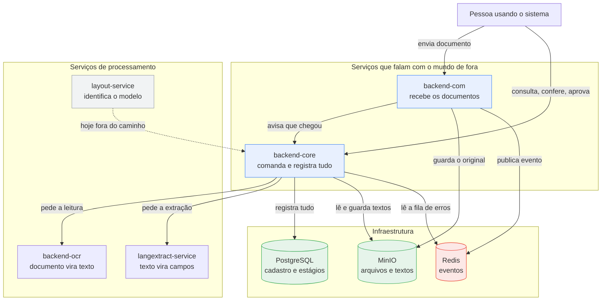
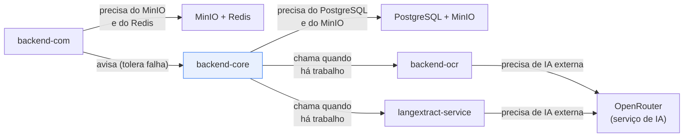

# DocuParse — As peças do sistema, explicadas

> **Para quem é este documento:** quem precisa entender como o DocuParse é montado por dentro sem
> ter participado do desenvolvimento — produto, operação, suporte, novos integrantes do time.
>
> Sem código e sem detalhes de implementação. A versão completa está em
> [backends-arquitetura.md](backends-arquitetura.md); o passo a passo do documento está em
> [visao-geral-do-fluxo.md](../workflow/visao-geral-do-fluxo.md).
>
> **Atualizado em:** 2026-07-28

---

## 1. A ideia em uma frase

O DocuParse não é um programa único: são **cinco serviços especializados** que dividem o trabalho,
mais três peças de infraestrutura que guardam informação. Cada serviço faz **uma coisa só** e passa
o bastão adiante.

| Serviço | O que faz |
|---|---|
| **backend-com** | Recebe os documentos que chegam (upload, e-mail, WhatsApp), confere o básico e protocola |
| **backend-core** | Comanda o processo: sabe em que estágio está cada documento, distribui as tarefas e registra tudo |
| **backend-ocr** | Lê o documento e devolve o texto |
| **langextract-service** | A partir do texto, preenche os campos (valor, CNPJ, número da nota…) |
| **layout-service** | Identifica de que modelo de documento se trata |

| Infraestrutura | O que guarda |
|---|---|
| **MinIO** (storage de arquivos) | Os documentos originais e o texto extraído deles |
| **PostgreSQL** (banco de dados) | O cadastro: quem é cada documento, em que estágio está, quem decidiu o quê |
| **Redis** | Os eventos — avisos de "isto aconteceu" que um serviço deixa para os outros |

---

## 2. O mapa das peças

**Duas regras que explicam quase tudo neste desenho:**

1. **Só o backend-core tem memória.** O backend-ocr e o langextract-service não guardam nada:
   recebem um pedido, devolvem o resultado e esquecem. Se você perguntar a eles "como está o
   documento X?", não sabem responder — só o backend-core sabe.
2. **O arquivo não fica indo e voltando.** Ele é gravado no MinIO logo na entrada; daí em diante os
   serviços trocam **o endereço do arquivo**, não o arquivo inteiro.

---

## 3. Cada serviço, um por vez

### backend-com — a porta de entrada

**O que faz:** recebe documentos por três caminhos — upload no site, anexo de e-mail e arquivo
enviado por WhatsApp — e trata os três exatamente da mesma forma daí em diante.

**O que ele confere:** o formato está entre os aceitos? O arquivo não está vazio? Está dentro do
tamanho máximo? Já existe um documento com esse mesmo nome? Só isso. **O backend-com não sabe o que
o documento é** — não sabe se é nota fiscal ou boleto, e não precisa saber.

**O que ele faz depois:** grava o original no MinIO, publica um evento no Redis ("chegou documento
novo") e avisa o backend-core diretamente.

**Se ele parar:** nenhum documento novo entra, por nenhum dos três canais. Os documentos que já
estão no sistema continuam sendo processados normalmente.

---

### backend-core — o comando

**O que faz:** é o cérebro. Sabe em que estágio está cada documento, decide o que precisa acontecer
em seguida, pede o serviço aos outros backends e registra o resultado no banco.

**Também é responsável por:** login e permissões, separação entre clientes, a tela de conferência,
as configurações, o histórico de alterações e a fila de erros.

**Se ele parar:** o sistema inteiro para. Nada é registrado, nada aparece na tela, nenhuma decisão é
gravada. É a peça mais crítica — e a única que guarda o estado do processo.

---

### backend-ocr — leitura do documento

**O que faz:** recebe o arquivo e devolve o texto. Antes de ler, decide **como** ler: um PDF gerado
por computador já tem texto por dentro e é lido direto; uma foto de papel precisa de inteligência
artificial de visão; um documento manuscrito precisa de tratamento reforçado.

**Como se protege:** se a técnica escolhida falhar, tenta automaticamente outra. O caso mais comum é
o PDF que parece digital mas é uma foto escaneada: a leitura direta volta vazia, o sistema percebe e
refaz com IA de visão.

**Se ele parar:** os documentos entram e ficam parados sem texto. Nada se perde — basta mandar
reprocessar quando ele voltar.

---

### langextract-service — extração dos campos

**O que faz:** recebe o texto e a lista de campos esperados, e devolve cada campo preenchido. É a
parte que usa inteligência artificial de linguagem.

**O detalhe importante:** quando não encontra um valor, ele não inventa — devolve o campo marcado
como `"Valor não encontrado"`, para a pessoa preencher na conferência. Se a IA estiver totalmente
indisponível, **todos** os campos voltam assim. Isso é intencional: é melhor entregar uma ficha
visivelmente incompleta do que uma ficha com dados inventados.

**Se ele parar:** os documentos ficam parados com o texto já lido, e o motivo da falha fica
registrado e visível. Depois é só rodar a extração de novo.

---

### layout-service — identificação do modelo

**O que faz:** olha o texto e diz de que modelo de documento se trata — nota fiscal, boleto de um
banco específico, fatura de energia.

**A situação hoje:** **ele não está sendo usado no caminho normal.** O backend-core tem seu próprio
reconhecimento embutido e o usa em vez de perguntar a este serviço. Ele existe, funciona, e só entra
em ação num modo de operação alternativo (seção 5).

**Se ele parar:** nada acontece, no funcionamento atual.

---

## 4. O papel do Redis

Esta é a peça que mais gera confusão, então vale detalhar.

### O que é

Um **quadro de eventos**: cada serviço publica ali avisos de que terminou sua parte — "documento
novo chegou", "terminei a leitura deste documento", "falhei ao ler este outro". Os avisos ficam
gravados em ordem de chegada e **não são apagados quando alguém lê**.

### O que ele **não** é

Apesar de o Redis ser conhecido no mercado como ferramenta de cache (memória rápida), **aqui ele não
guarda cache, não guarda sessões de usuário e não funciona como fila de tarefas**. É só o quadro de
eventos.

> Documentações antigas do projeto descreviam o Redis como "barramento de eventos + cache". Só a
> primeira metade é verdade.

### Quem usa o Redis

| Serviço | O que faz no Redis |
|---|---|
| **backend-com** | **Publica** o evento "chegou documento novo" — sempre |
| **backend-core** | **Lê** a fila de erros para mostrar na tela de Operações. Também *publicaria* eventos de integração com sistemas externos — mas essa parte ainda não está ligada, então na prática ele não publica nada |
| **backend-ocr** | Só participa no modo alternativo: lê "chegou documento" e publica "terminei a leitura" |
| **layout-service** | Só no modo alternativo: lê "leitura terminada" e publica "modelo identificado" |
| **langextract-service** | Só no modo alternativo: lê "modelo identificado" e publica "campos extraídos" |

### O ponto que surpreende

**No funcionamento padrão, os eventos são publicados mas ninguém os lê.** O backend-core não espera
pelo Redis: ele chama cada serviço diretamente e aguarda a resposta. O Redis funciona, na prática,
como um **registro histórico** do que aconteceu — útil para auditoria e para o dia em que o sistema
for operado no modo alternativo.

A exceção é o backend-com: para ele, publicar o evento é obrigatório. **Se o Redis estiver fora do
ar, o upload falha.** É a única situação em que a indisponibilidade do Redis afeta o usuário no
funcionamento normal.

> **Conferido no ambiente em execução (28/07/2026):** o Redis tinha exatamente **um evento** — o
> "chegou documento novo" do único upload feito — e **nenhum leitor registrado**. Nenhum evento de
> leitura, extração ou integração havia sido publicado, e não havia mais nada guardado ali (nenhum
> cache, nenhuma sessão). É a confirmação prática dos dois parágrafos acima.

### A fila de erros (DLQ)

Quando um serviço tenta processar um evento e falha, ele **grava esse evento numa fila separada — a
fila de erros, ou DLQ** — e segue para o próximo. Um documento problemático nunca trava a fila.

A tela de Operações mostra essa fila e permite **reenviar** um evento para nova tentativa. Cada
reenvio fica registrado com autor e observação.

### Limitações que a operação precisa conhecer

| Limitação | O que significa na prática |
|---|---|
| Cada serviço guarda "onde parou" só na própria memória | Se um serviço reinicia, ele volta a ler **a partir dos eventos novos** — os do período em que esteve fora podem ser pulados |
| Não há nova tentativa automática | Uma falha temporária não é retentada sozinha: vira um item na fila de erros, para reenvio manual |
| Todo mundo lê tudo | Colocar duas cópias do mesmo serviço para dar conta do volume faria as duas processarem o **mesmo** documento, em duplicidade |
| Os eventos nunca são apagados | Eles se acumulam indefinidamente; é preciso pensar em uma política de limpeza no futuro |

---

## 5. Os dois modos de funcionamento

O mesmo processo pode rodar de duas maneiras. **Hoje, o padrão é o modo A.**

| | **Modo A — backend-core no comando** (padrão) | **Modo B — orientado a eventos** |
|---|---|---|
| Como funciona | O backend-core chama cada serviço e espera a resposta | Cada serviço lê os eventos do Redis, faz sua parte e publica o próximo evento |
| Papel do Redis | Registro histórico | **Essencial** — sem ele nada anda |
| layout-service | Fora do caminho | Participa |
| Quando algo falha | Fica no registro do backend-core; recuperação manual | Vai para a fila de erros; pode ser reenviado |
| Quantos documentos ao mesmo tempo | Poucos por vez (fila curta) | Um por serviço, em paralelo |
| Vantagem | Menos peças, mais simples de acompanhar | Aguenta mais volume, isola falhas |

Existe ainda um terceiro modo, com um orquestrador visual de processos (Camunda), montado mas não
usado no dia a dia.

---

## 6. Quem depende de quem

**Leitura do diagrama:** o backend-core depende do PostgreSQL e do MinIO o tempo todo; dos serviços
de processamento, só no momento em que há trabalho a fazer. Isso significa que **o backend-ocr e o
langextract-service podem estar fora do ar sem derrubar o sistema** — os documentos apenas se
acumulam esperando.

Não existe dependência circular: nenhum serviço precisa de outro que, por sua vez, precise dele para
funcionar. A única conversa de mão dupla é entre backend-com e backend-core, e nos dois sentidos ela
tolera falha.

---

## 7. Se um serviço parar, o que o usuário sente

| Fora do ar | O que o usuário percebe | Os documentos se perdem? |
|---|---|---|
| **backend-core** | Nada funciona: não entra, não lista, não aprova | Os que estavam no sistema, não. Os enviados durante a queda, sim — precisam ser reenviados |
| **PostgreSQL** | Nada funciona | Não |
| **MinIO** | Upload falha; a leitura não consegue abrir o documento | Não |
| **Redis** | Upload falha; a tela de Operações não carrega | Não |
| **backend-com** | Não consegue enviar documentos novos | Não |
| **backend-ocr** | Documentos entram e ficam parados sem texto | Não — é só reprocessar |
| **langextract-service** | Documentos param com o texto lido e sem campos | Não — é só rodar de novo |
| **OpenRouter** (IA externa) | Campos voltam como "Valor não encontrado" | Não |
| **layout-service** | Nada muda | Não |

**Regra geral:** com o PostgreSQL e o MinIO de pé, **nenhum documento já registrado se perde**. As
falhas dos demais serviços só fazem os documentos ficarem parados esperando.

---

## 8. Perguntas frequentes

**Por que não fazer tudo em um sistema só?**
Porque as partes têm necessidades muito diferentes. A leitura de documentos é lenta e pesada; a
captura precisa ser rápida e sempre disponível; o comando precisa de um banco de dados confiável.
Separando, uma parte lenta não trava as outras — e cada uma pode ser atualizada ou reiniciada sem
derrubar o resto.

**Por que existe o Redis se ninguém lê os eventos no modo padrão?**
Porque ele é a base do modo B, que é para onde o sistema cresce quando o volume aumentar. Manter os
eventos sendo publicados desde já significa que a migração é uma mudança de configuração, não uma
reescrita. E, enquanto isso, eles servem de histórico.

**Se a IA errar um campo, o que acontece?**
Nada automático. Todo documento passa por conferência humana antes de ser aprovado, e a correção
feita ali fica registrada como uma nova versão da lista de campos.

**Dois clientes podem ver os documentos um do outro?**
Não. A separação é feita no próprio banco de dados, com uma área isolada por cliente.

---

## 9. Glossário

| Termo | O que é |
|---|---|
| **Backend / serviço** | Um programa que roda no servidor e faz uma parte do trabalho |
| **Stateless** | Serviço "sem memória": não guarda nada entre um pedido e outro |
| **Evento** | Uma mensagem de "isto aconteceu", publicada para quem interessar |
| **Redis** | A ferramenta onde os eventos são publicados e guardados |
| **MinIO / storage** | Onde ficam os arquivos originais e os textos extraídos |
| **DLQ (fila de erros)** | Fila com os eventos que falharam ao ser processados |
| **OCR** | Transformar imagem em texto |
| **Extração** | Transformar texto em campos preenchidos |
| **Modelo / schema** | A lista de campos esperados para um tipo de documento |
| **Tenant / cliente** | Organização cujos dados ficam isolados dos demais |
| **OpenRouter** | Serviço externo que dá acesso aos modelos de IA usados na leitura e na extração |
