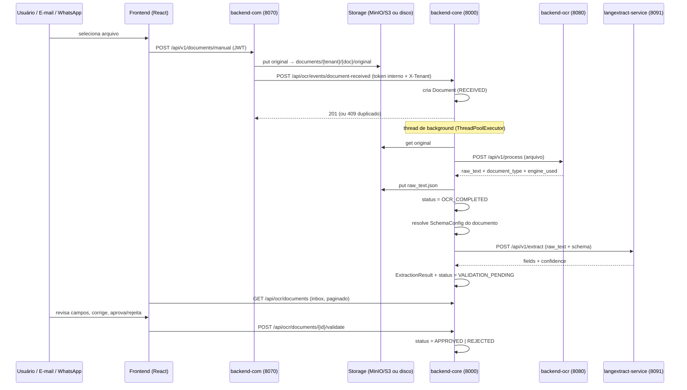
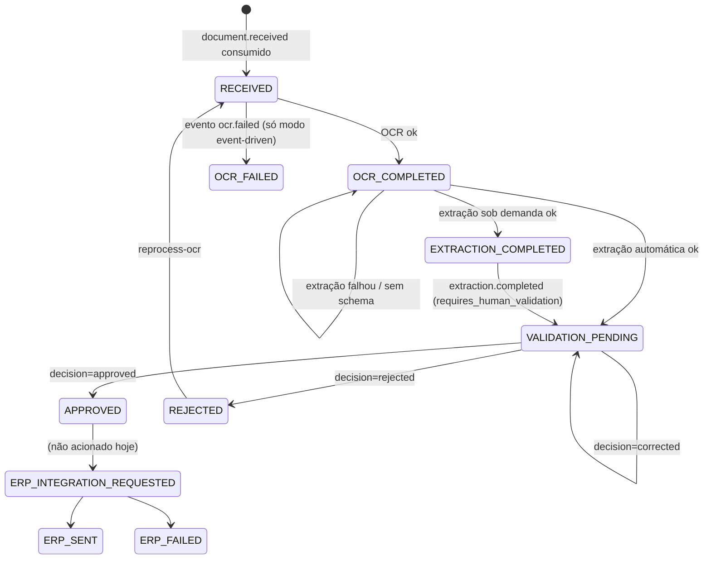

# DocuParse — Fluxo da Aplicação (visão de alto nível)

> **Atualizado em:** 2026-07-27 · **Base:** branch `013-file-download-organization` (commit `0b06fe0`)
>
> Este documento descreve o **fluxo principal ponta a ponta** do DocuParse: cada etapa, a
> decisão tomada em cada ponto, os caminhos alternativos, o que acontece quando algo falha e
> onde isso está no código.
>
> **Relação com os outros documentos:**
> - `docuparse-project/docs/TECHNICAL.md` — referência por componente (endpoints, stack, env). Complementar a este.
> - `workflow.md` (raiz) — **desatualizado**: descreve o fluxo antigo em que o frontend enviava o arquivo direto para `POST /api/ocr/process` e o backend-ocr fazia extração de campos/fallback por score. Hoje a extração de campos é feita por LLM no `langextract-service` e o `/process` do core é rota legada.
> - `docs/architecture.md` — **desatualizado**: descreve só 3 serviços e ignora captura, storage compartilhado, eventos e multi-tenancy.

---

## Índice

1. [Resumo em uma tela](#1-resumo-em-uma-tela)
2. [Peças do sistema](#2-peças-do-sistema)
3. [Etapa 0 — Autenticação e resolução do tenant](#3-etapa-0--autenticação-e-resolução-do-tenant)
4. [Etapa 1 — Captura do documento (backend-com)](#4-etapa-1--captura-do-documento-backend-com)
5. [Etapa 2 — Registro no backend-core](#5-etapa-2--registro-no-backend-core)
6. [Etapa 3 — OCR](#6-etapa-3--ocr)
7. [Etapa 4 — Extração de campos (LLM)](#7-etapa-4--extração-de-campos-llm)
8. [Etapa 5 — Validação humana](#8-etapa-5--validação-humana)
9. [Etapa 6 — Pós-aprovação: export e ERP](#9-etapa-6--pós-aprovação-export-e-erp)
10. [Máquina de estados do documento](#10-máquina-de-estados-do-documento)
11. [Os dois (três) modos de orquestração](#11-os-dois-três-modos-de-orquestração)
12. [Storage de objetos e chaves](#12-storage-de-objetos-e-chaves)
13. [Multi-tenancy](#13-multi-tenancy)
14. [Configuração que muda o caminho do fluxo](#14-configuração-que-muda-o-caminho-do-fluxo)
15. [Observabilidade, diagnóstico e DLQ](#15-observabilidade-diagnóstico-e-dlq)
16. [Lacunas conhecidas e código legado](#16-lacunas-conhecidas-e-código-legado)
17. [Mapa código → responsabilidade](#17-mapa-código--responsabilidade)

---

## 1. Resumo em uma tela



O fluxo tem **duas fronteiras de responsabilidade importantes**:

- **backend-com** só captura e publica. Ele nunca sabe o que é o documento.
- **backend-core** é o único dono do estado. OCR e extração são serviços **stateless** chamados por ele.

---

## 2. Peças do sistema

| Componente | Stack | Porta | Papel no fluxo |
|---|---|---|---|
| `frontend` | React 18 + Vite + TS | 5173 | SPA de arquivo único (`src/main.tsx`, ~5k linhas). Upload, inbox, validação, configurações, admin. |
| `backend-core` | Django 5 + DRF | 8000 | Orquestrador e dono do estado. Auth JWT, multi-tenancy, documentos, schemas, validação, DLQ. |
| `backend-com` | FastAPI | 8070 | Captura: upload manual, webhook/IMAP de e-mail, WhatsApp (Twilio). |
| `backend-ocr` | FastAPI | 8080 | Classifica o arquivo, escolhe o engine e devolve texto bruto. Sem estado. |
| `langextract-service` | FastAPI | 8091 | Extrai campos estruturados do texto via LLM (OpenRouter), guiado por um schema. Sem estado. |
| `layout-service` | FastAPI | 8090 | Classificação de layout por heurística de texto. **Não está no caminho síncrono atual** (ver §16). |
| PostgreSQL | 16 | 5432 | Um schema por tenant (`django_tenants`). |
| Redis | 7 | 6380→6379 | Barramento de eventos (Redis Streams) quando `DOCUPARSE_EVENT_BUS=redis`. |
| MinIO | — | 9002/9003→9000/9001 | Object storage dos binários e do `raw_text.json`. |
| Camunda/Zeebe + workers | — | perfil `camunda` | Orquestração BPMN alternativa, opcional (ver §11). |

---

## 3. Etapa 0 — Autenticação e resolução do tenant

Nada acontece antes de existir um **tenant ativo** no contexto da requisição.

**Login** (`POST /api/auth/login` → `users/auth_views.py:login_view`):

1. Busca o usuário pelo e-mail (username). Se existe mas está inativo → **403** com mensagem explícita (antes de `authenticate()` engolir o caso).
2. Valida credenciais. Falha → **401** genérico.
3. Busca o `UserProfile` (que liga usuário ↔ tenant ↔ role). Se o tenant estiver inativo → **403**.
4. Emite o par JWT com a claim extra **`tenant` = slug do tenant**. Sem `UserProfile`, o token sai sem a claim — e aí toda rota de tenant falha adiante.

**Resolução do schema** (`tenants/middleware.py:JWTTenantMiddleware`) roda **antes de qualquer view**:

| Caso | Como resolve | Resultado |
|---|---|---|
| Rota pública (`/admin/`, `/api/auth/`, `/api/admin/tenants/`) ou `/api/ocr/health` | não resolve | fica no schema `public`, `request.tenant = None` |
| `Authorization: Bearer <token interno de serviço>` | header **`X-Tenant`** (obrigatório; sem ele → `SuspiciousOperation`) | `connection.set_tenant(...)` |
| `Authorization: Bearer <JWT>` | decodifica o payload **sem verificar assinatura** só para ler a claim `tenant` (a validação real vem depois, no DRF) | `connection.set_tenant(...)` |
| Nenhum dos dois | — | `SuspiciousOperation` (400) |

Tenant inexistente → `SuspiciousOperation`; tenant inativo → `PermissionDenied` (403).

**Autorização por permissão** (`users/permissions.py`): cada view sensível é decorada com
`require_permission("<code>")`. A checagem é `user.docuparse_profile.role_ref.permissions`
contém o código. **Chamadas com o token interno de serviço passam sempre** (`request.auth == "service_token"`).

Permissões usadas na navegação: `documents.send` (Upload), `inbox.view` (Inbox/Dashboard),
`documents.validate` (Validação), `operations.access` (Operações), `users.manage`,
`roles.manage`, `tenants.manage`.

---

## 4. Etapa 1 — Captura do documento (backend-com)

Três canais, **um único caminho interno** — todos convergem para
`backend_com/services/document_ingest.py:ingest_document()`:

| Canal | Endpoint | Autenticação |
|---|---|---|
| `manual` | `POST /api/v1/documents/manual` | JWT do usuário (o frontend anexa o mesmo token do core) |
| `email` | `POST /api/v1/email/webhook` (assinatura HMAC) · `POST /api/v1/email/messages` (IMAP) · `POST /api/v1/email/poll` | assinatura / token interno |
| `whatsapp` | `POST /api/v1/whatsapp/webhook` · `POST /api/v1/whatsapp/poll` | Twilio / token interno |

**O que `ingest_document` decide, em ordem** (qualquer falha → `ValueError` → **400**):

1. `tenant_slug` (extraído do JWT) **sobrescreve** o `tenant_id` do form — o cliente não escolhe o tenant.
2. `channel` deve ser `manual | email | whatsapp`.
3. `filename` não vazio, conteúdo não vazio.
4. Tamanho ≤ `max_upload_bytes`.
5. `content_type` na allowlist: PDF, JPEG, PNG, TIFF, WEBP. **Não há detecção por conteúdo aqui** — confia-se no `Content-Type` declarado.

Passando a validação:

6. Gera `document_id` (UUID) e grava o binário em `documents/{tenant}/{document_id}/original`, obtendo `uri`, `size_bytes` e `sha256`.
7. Publica `document.received` no **event bus** (Redis Streams ou JSONL local).
8. **Sincroniza via HTTP** com o backend-core: `POST /api/ocr/events/document-received`, com `Authorization: Bearer <token interno>` + `X-Tenant: <slug>`, **timeout de 2 s**.

**Caminhos do passo 8** — este é o ponto mais sutil do fluxo:

| Resposta do core | O que o backend-com faz |
|---|---|
| 2xx | retorna `core_sync_status: "synced:<código>"` |
| **409** (documento duplicado) | levanta `DuplicateDocumentError` → a API devolve **409** para o usuário |
| outro erro HTTP / timeout / rede | **loga um warning e segue**, retornando `core_sync_status: "failed"` |
| `BACKEND_CORE_DOCUMENT_RECEIVED_URL` vazio | `"disabled"` |

> **Consequência prática:** o upload é considerado bem-sucedido mesmo quando o core não responde
> em 2 s. O arquivo já está no storage e o evento já está no bus, então o documento ainda pode ser
> registrado depois pelo worker de eventos (§11) — mas no modo síncrono (sem `async-workers`) ele
> fica **órfão**: existe no storage e não aparece no inbox.

---

## 5. Etapa 2 — Registro no backend-core

`POST /api/ocr/events/document-received` → `documents/views.py:document_received_event_view`
→ `services/event_consumers.py:consume_document_received`.

Tudo dentro de uma transação:

1. **Idempotência por evento**: `DocumentEvent` é gravado uma única vez por `event_id`. Se o evento já existe e já aponta para um documento, retorna o documento existente — reentregas não duplicam nada.
2. **Deduplicação por nome de arquivo**: se já existe um `Document` com o mesmo `original_filename` **no tenant**, levanta `DuplicateDocumentError` → **409** (`"O Documento 'x.pdf' já existe!"`). Note que a chave é o **nome**, não o `sha256` (que é gravado, mas não usado como critério).
3. Cria o `Document` com status **`RECEIVED`**, guardando `file_uri`, `content_type`, `size_bytes`, `sha256`, `channel`, `correlation_id`, `received_at` e `metadata`.

**Disparo automático do OCR** (de volta na view):

```
se DOCUPARSE_AUTO_PROCESS_OCR
   e o documento ainda não tem raw_text_uri
   e a query string não trouxe skip_auto_process=true
→ submit_document_processing(document.id)
```

`services/processing_queue.py` submete a um **`ThreadPoolExecutor` com 2 workers** (`DOCUPARSE_PROCESSING_WORKERS`).
O tenant corrente é capturado da conexão e **re-aplicado dentro da thread** (`connection.set_tenant(tenant)`) — sem isso a thread cairia no schema `public`.

A resposta **201** volta imediatamente, com o documento ainda em `RECEIVED`. O frontend descobre a
evolução por polling do inbox (`autoRefresh` enquanto houver documentos em processamento).

**Se a thread falhar**, nada propaga para o usuário: o erro vai para o log como
`processing_queue_failed | document_id=… | tenant=… | last_step=…`, onde `last_step` é a última
etapa alcançada (`load_document` → `storage_read` → `ocr_request` → `storage_write` → `ocr_completed`),
o que identifica qual dependência caiu.

---

## 6. Etapa 3 — OCR

`services/ocr_processor.py:process_document_ocr(document_id, tenant_slug)`.

### 6.1 No backend-core

1. Carrega o `Document`. Se `tenant_slug` não veio, deriva do nome do schema (`tenant_x` → `x`).
2. **Lê o binário** do storage por `file_uri` (roteado por esquema: `local://` ou `s3://`).
3. **Chama o backend-ocr**: `POST /api/v1/process` (multipart, `legacy_extraction=false`), **timeout de 300 s**.
4. Escolhe o texto: `raw_text` **ou**, se vazio, `raw_text_fallback`.
5. **Grava `raw_text.json`** em `documents/{tenant}/{doc}/ocr/raw_text.json` com `raw_text`, `raw_text_formatted`, `document_type`, `engine_used` e metadados de OCR.
6. Atualiza o documento: `raw_text_uri`, `document_type`, status **`OCR_COMPLETED`**.
7. Chama `auto_extract_after_ocr(document)` (etapa 4).

Qualquer exceção aqui aborta a etapa 4 — o documento **permanece em `RECEIVED`**.

### 6.2 Dentro do backend-ocr

`application/process_document.py:process_document()` — quatro decisões encadeadas:

**(a) Classificação** (`domain/classifier.py`), do sinal mais barato ao mais informativo:
extensão/assinatura de conteúdo → sinais do nome do arquivo → análise estrutural
(PyMuPDF: blocos de texto vs. imagem, fontes; OpenCV: densidade de arestas, estrutura de tabela).
Saída: `digital_pdf`, `scanned_image` ou `handwritten_complex`.
**Erro na classificação → assume `scanned_image`** (fallback seguro).

**(b) Escolha do engine** (`domain/engine_resolver.py`):

| Prioridade | Regra |
|---|---|
| 1 | `selected_engine` enviado pela API (normalizando aliases: `paddleocr`→`paddle`, `hybrid`→`paddle_easyocr`, …) |
| 2 | Padrão da classe: `digital_pdf → docling`, `scanned_image → openrouter`, `handwritten_complex → openrouter` |
| 3 | Fallback global: `tesseract` |

Engine não registrado (dependência ausente no ambiente) → cai em `tesseract`.
O registry (`ENGINE_REGISTRY`) é montado no import com *lazy registration*: um engine que
não importa apenas fica indisponível, **não derruba o serviço**.

**(c) Execução e fallbacks**:

| Situação | Caminho |
|---|---|
| Engine lança exceção | tenta `tesseract` (ou `easyocr` se o que falhou já era tesseract) e mescla o resultado; `engine_used` vira `"<primário>_with_<fallback>_fallback"` |
| O fallback também falha | propaga a exceção original → 500 |
| **Docling devolveu texto vazio** com `fallback_recommended` | reprocessa com engine de visão (`openrouter`, ou `tesseract`), **reclassifica para `scanned_image`** — caso clássico do PDF escaneado que a classificação leu como digital por causa das linhas de tabela |

**(d) Resposta**: `raw_text`, `raw_text_fallback`, `raw_text_formatted`, `document_type`,
`engine_used`, `preprocessing_hint`, `processing_time_seconds` e um bloco `debug` com a
classificação e o meta do engine. Os campos `fields`/`final_score` vêm vazios: **extração de campos
não é mais responsabilidade do backend-ocr** (só existe sob `legacy_extraction=true`).

### 6.3 Disparos manuais de OCR

| Endpoint | Comportamento |
|---|---|
| `POST /api/ocr/documents/{id}/process-ocr` | roda `process_document_ocr` **inline** (síncrono). Arquivo ausente → 404; falha no OCR → 502 |
| `POST /api/ocr/documents/{id}/reprocess-ocr` | idem, mas antes, se o documento estava `REJECTED`, volta para `RECEIVED` |

---

## 7. Etapa 4 — Extração de campos (LLM)

### 7.1 Automática, após o OCR

`ocr_processor.py:auto_extract_after_ocr()`. Sai sem fazer nada se
`DOCUPARSE_AUTO_PROCESS_EXTRACTION=false`, se não há `raw_text_uri`, ou se o texto está vazio.

**Resolução do schema** (`_resolve_schema_for_extraction`) — a decisão central desta etapa:

| Ordem | Fonte | Racional |
|---|---|---|
| 1 | `LayoutConfig` ativo com `layout == document.layout` | configuração explícita do admin ganha de qualquer heurística |
| 2 | **Classificador de texto** (`models/nota_fiscal`, `models/contadeagua`, `models/boleto`, nesta cascata) → `SchemaConfig` ativo com aquele `schema_id` | heurística por palavras-chave sobre o texto do OCR |
| 3 | `LayoutConfig` ativo com `document_type == document.document_type` | rede de segurança para schemas customizados |

**Sem schema resolvido** → grava `metadata.extraction.state = "pending_no_schema"` e **para**.
O documento fica em `OCR_COMPLETED` e o operador escolhe o modelo manualmente na tela de Validação.

Com schema:

1. Monta a `definition` injetando `schema_id`/`version` (que vivem como colunas do model, não dentro do JSON).
2. `POST /api/v1/extract` no langextract-service (**timeout 120 s**).
3. Persiste `ExtractionResult` (`update_or_create`, 1:1 com o documento) e move o status para **`VALIDATION_PENDING`**.
4. Registra o ciclo de vida em `metadata.extraction` (`running` → `completed` | `failed`, com `duration_ms`, `confidence`, `error`, `service_url`) — é isso que torna a falha visível na UI e consultável no banco, em vez de morrer num log.

**Falha na extração** → `state = "failed"`, o documento **permanece em `OCR_COMPLETED`** e pode ser reprocessado manualmente.

### 7.2 Dentro do langextract-service

- **Com `schema_definition`** → `domain/llm_extractor.py`: monta um prompt com os campos esperados, as instruções e os exemplos do schema, e chama a **OpenRouter chat-completions** (`OPENROUTER_API_KEY`, `OPENROUTER_MODEL`).
- **Sem `schema_definition`** → `domain/extractor.py`: extração por regex (caminho legado).
- **Degradação explícita:** sem API key, ou com falha de chamada/parse do JSON, **todo campo esperado volta preenchido com `"Valor não encontrado"`** em vez de erro. O documento chega à validação humana com a lista completa de campos vazios — falha visível, não silenciosa.

### 7.3 Extração sob demanda (tela de Validação)

`POST /api/ocr/documents/{id}/langextract` com `schema_config_id`.

Validações, nesta ordem: `schema_config_id` obrigatório (400) → documento e schema existem (404) →
documento tem `raw_text_uri` (400, *"Execute o OCR primeiro"*) → o `raw_text.json` é legível (500) →
texto não vazio (400) → `definition` é um objeto válido (400). Falha na chamada ao serviço → **502**.

Diferenças em relação à extração automática:

- **Cria uma `ExtractionFieldVersion`** (`INITIAL_EXTRACTION` na primeira vez, `REPROCESSING` depois). O caminho automático grava apenas o `ExtractionResult`.
- Move para `EXTRACTION_COMPLETED` **apenas se** o documento ainda não estiver em `VALIDATION_PENDING`, `APPROVED` ou `REJECTED` — reprocessar não desfaz uma decisão já tomada.
- É **síncrono** (responde 200 com o resultado). O frontend também aceita **202**: nesse caso ele faz *polling* do detalhe do documento (até 40 tentativas × 2,5 s) até o `extraction_result.updated_at` mudar ou `metadata.extraction.state == "failed"` aparecer. Existe um caminho assíncrono pronto (`processing_queue.submit_document_langextract`) que hoje **não está ligado à view** (§16).

---

## 8. Etapa 5 — Validação humana

### 8.1 Inbox

`GET /api/ocr/documents` (`documents_inbox_view`, exige `inbox.view`):

- **Paginação server-side**: `page`/`page_size` (default e **teto de 25**), envelope `{results, count, page, page_size, total_pages}`.
- **Filtro por status**: valor único ou CSV (`?status=RECEIVED,OCR_COMPLETED,...`) — é assim que a UI monta o balde "Pendentes".
- **Busca** (`?search=`): `icontains` sobre nome do arquivo, status, tipo, canal **e sobre os valores dos campos extraídos** (cast do JSON para texto), além de mapear rótulos amigáveis (`"aprovado"` → `APPROVED`, `"pendente"` → o conjunto de status em processamento).

O frontend rotula todos os status intermediários como **"Pendente"**; só `APPROVED` e `REJECTED` têm rótulo próprio.

### 8.2 Tela de Validação

Ao abrir um documento:

1. `GET /api/ocr/documents/{id}` traz o detalhe, incluindo `full_transcription` (lida do `raw_text.json` no storage) e `active_field_version_number`.
2. O arquivo original é exibido num `<iframe>` via `GET /api/ocr/documents/{id}/file` — endpoint com **dupla autenticação** (JWT com `inbox.view` **ou** token interno) e `@xframe_options_exempt`, porque frontend e backend ficam em origens diferentes.
3. **Auto-seleção do modelo**: usa o `schema_id` da última extração; se não houver, chama `POST /api/ocr/classify-text` com o texto do OCR e seleciona o schema correspondente.
4. Campos com valor vazio ou `"valor não encontrado"` são filtrados da lista editável.

### 8.3 Salvar campos (versionamento)

`PUT /api/ocr/documents/{id}/fields` (exige `documents.validate`) → `services/field_versioning.py:save_manual_edit`.

Cada salvamento cria uma **`ExtractionFieldVersion` imutável** e a torna a versão ativa
(constraint de banco garante **no máximo uma ativa por documento**).

| Situação | Resposta |
|---|---|
| `fields` não é lista | 400 |
| `base_version_number` ≠ versão ativa | **409** com `active_version_number` — bloqueio otimista contra sobrescrita concorrente |
| lista vazia | 422 |
| nenhuma mudança real | 422 |
| ok | 201 com a nova versão |

`GET /api/ocr/documents/{id}/field-versions` devolve o histórico completo (somente leitura).

### 8.4 Decisão

`POST /api/ocr/documents/{id}/validate` (exige `documents.validate`), com `decision`,
`notes` e `corrected_fields`.

Regras, na ordem:

1. `decision` ∈ `approved | rejected | corrected`, senão 400.
2. **Sem `ExtractionResult` → 422**: não se aprova nem se rejeita um documento cuja extração não rodou.
3. `rejected` **exige** `notes` não vazio → 400.
4. Autor da decisão: usuário autenticado, ou `decided_by_id` do corpo; em último caso o primeiro usuário do banco (fallback histórico para chamadas de serviço).
5. Grava a `ValidationDecision`.
6. Se vieram `corrected_fields`: marca `requires_human_validation = False` e cria uma versão `MANUAL_EDIT` (silenciosamente ignorada se não houver mudança efetiva).
7. Transição: `approved` → **`APPROVED`**; `rejected` → **`REJECTED`**; `corrected` → **`VALIDATION_PENDING`** (volta para a fila).

---

## 9. Etapa 6 — Pós-aprovação: export e ERP

Esta etapa está **implementada mas não acionada** pela API atual (ver §16).

O que existe: `services/erp_publisher.py:publish_erp_integration_requested(document)` monta um
payload canônico (id, tenant, schema, campos, URIs de origem), cria um `ERPIntegrationAttempt`
com chave de idempotência `"{tenant}:{document_id}:erp:v1"`, opcionalmente exporta um JSON/JSONL
para `IntegrationSettings.approved_export_dir` e publica `erp.integration.requested` no bus.
Os eventos de retorno `erp.sent` / `erp.failed` já têm consumidores (`event_consumers.py`) que
movem o documento para `ERP_SENT` / `ERP_FAILED`.

Falta o gatilho: **nenhuma rota nem sinal chama `publish_erp_integration_requested`**. Hoje o
fluxo termina em `APPROVED`.

---

## 10. Máquina de estados do documento



| Status | Quem escreve | Significado |
|---|---|---|
| `RECEIVED` | `consume_document_received` | registrado, nada processado |
| `OCR_COMPLETED` | `process_document_ocr` / `consume_ocr_completed` | há texto no storage |
| `OCR_FAILED` | `consume_ocr_failed` | só no modo event-driven; o modo síncrono deixa em `RECEIVED` |
| `LAYOUT_CLASSIFIED` | — | **nunca atribuído** no código atual |
| `EXTRACTION_COMPLETED` | extração sob demanda | campos extraídos, sem exigência explícita de validação |
| `VALIDATION_PENDING` | extração automática / `corrected` | aguardando decisão humana |
| `APPROVED` / `REJECTED` | `document_validation_view` | terminal (rejeitado pode ser reprocessado) |
| `ERP_*` | `erp_publisher` / consumidores | integração externa |

---

## 11. Os dois (três) modos de orquestração

O mesmo pipeline lógico existe em três implementações. **A configuração decide qual está ativa.**

### A) Síncrono / thread pool — **modo padrão**

`docker compose up`. O backend-core chama backend-ocr e langextract-service por HTTP, dentro de
um `ThreadPoolExecutor` de 2 threads. Os eventos ainda são **publicados** no Redis, mas ninguém os consome.

- **Vantagem:** menos peças, latência menor, erro visível no log do core.
- **Limite:** o paralelismo é o do pool; um pico de uploads enfileira. Falha de thread só aparece no log.

### B) Event-driven — perfil `async-workers`

`docker compose --profile async-workers up` sobe `backend-core-events`, `backend-ocr-worker`,
`layout-worker` e `langextract-worker`. Cada serviço consome do Redis Streams e publica o próximo evento:

```
document.received → backend-ocr-worker → ocr.completed
ocr.completed     → layout-worker      → layout.classified
layout.classified → langextract-worker → extraction.completed
(todos)           → backend-core-events (CoreEventStreamWorker) → atualiza o Document
```

Consumidores do core: `document.received`, `ocr.completed`, `ocr.failed`, `extraction.completed`,
`erp.sent`/`erp.failed` (`services/event_stream_worker.py`).

- **Idempotência:** cada consumidor grava um `DocumentEvent` único por `event_id` e ignora reentregas.
- **Falha:** o evento vai para a **DLQ** (`<stream>.dlq`) via `publish_dead_letter`, e o worker **segue** para o próximo — um documento problemático não trava a fila.
- É neste modo que `layout-service` e os status `OCR_FAILED` entram efetivamente no fluxo.

### C) Camunda / BPMN — perfil `camunda`

`bpmn/flow.bpmn` + `camunda-workers/` (workers de documento, OCR, layout, extração, validação, ERP)
sobre Zeebe/Operate/Tasklist. Orquestração externa e explícita, com o processo visível no Operate.
Opcional e independente dos modos A e B.

---

## 12. Storage de objetos e chaves

`shared/docuparse_storage/` é o **único ponto de instanciação de storage** (`get_storage()`).

**Chaves canônicas** (`keys.py`):

```
documents/{tenant_id}/{document_id}/original
documents/{tenant_id}/{document_id}/ocr/raw_text.json
```

**Seleção de backend** por `DOCUPARSE_STORAGE_BACKEND`:

- `local` (default do código) → `LocalStorage` em `DOCUPARSE_LOCAL_STORAGE_DIR`; `boto3` nem é importado.
- `s3` (default do `docker-compose.yml`, apontando para o MinIO) → exige `S3_BUCKET`; **falha na construção** se a config estiver incompleta, nunca cai silenciosamente em local.

**Roteamento na leitura** (`RoutingStorage`): escreve sempre no backend configurado, mas lê
despachando **pelo esquema da URI** — `local://` → disco, `s3://` → S3, chave nua → backend de
escrita. É isso que permite migração incremental e rollback com URIs antigas convivendo com novas.

**Limpeza**: `documents/signals.py` remove binário e `raw_text.json` no `post_delete` do
`Document`, agendado com `transaction.on_commit` (se a transação der rollback, o objeto é
preservado). É best-effort: erro ao apagar apenas loga, e o command `reconcile_storage`
existe para reconciliar depois.

Commands relacionados: `migrate_storage_local_to_s3`, `reconcile_storage`.

---

## 13. Multi-tenancy

Implementado com **`django_tenants` (schema por tenant)**, feature 010.

- **`SHARED_APPS`** (schema `public`): `tenants`, `users`, auth, admin, JWT blacklist. Usuários, roles e permissões são **globais**.
- **`TENANT_APPS`** (schema `tenant_<slug>`): `documents`. Todo dado de documento é isolado por schema — não há coluna `tenant_id` nos models de documento.
- `Tenant.auto_create_schema = True`: criar um tenant cria e migra o schema.
- Boot (`entrypoint.sh`): `migrate_schemas --shared` → `seed_data` → `migrate_schemas` → `runserver`. A ordem importa: o seed cria o tenant default (e portanto o schema) antes da migração de tenants.
- **Troca de tenant na UI**: `POST /api/admin/tenants/{slug}/switch/` (exige `tenants.manage`) devolve um novo par JWT com a claim `tenant` trocada.
- **Chamadas serviço↔serviço** não têm JWT: usam o token interno + header `X-Tenant`.

---

## 14. Configuração que muda o caminho do fluxo

| Variável | Default | Efeito no fluxo |
|---|---|---|
| `DOCUPARSE_AUTO_PROCESS_OCR` | `true` | `false` → documento fica em `RECEIVED` até alguém chamar `process-ocr` |
| `DOCUPARSE_AUTO_PROCESS_EXTRACTION` | `true` | `false` → para em `OCR_COMPLETED`; extração só sob demanda |
| `DOCUPARSE_PROCESSING_WORKERS` | `2` | tamanho do pool de threads de processamento |
| `DOCUPARSE_EVENT_BUS` | `local` (compose: `redis`) | `local` → JSONL em disco; `redis` → Redis Streams |
| `DOCUPARSE_STORAGE_BACKEND` | `local` (compose: `s3`) | onde os objetos são gravados |
| `DOCUPARSE_INTERNAL_SERVICE_TOKEN` | vazio | **vazio deixa as rotas internas abertas** (dev). Definido → exige token ou JWT |
| `DOCUPARSE_REQUIRE_POSTGRES` | `false` | `true` impede o boot com o SQLite efêmero do container |
| `OPENROUTER_API_KEY` / `OPENROUTER_MODEL` | — | sem eles a extração devolve tudo como `"Valor não encontrado"` e o `/ready` do backend-ocr responde 503 |
| `DOCUPARSE_LOG_LEVEL` | `INFO` | sem config explícita, loggers fora da árvore `django` só emitiriam WARNING+ |

---

## 15. Observabilidade, diagnóstico e DLQ

| Recurso | Onde | Para quê |
|---|---|---|
| `GET /api/ocr/health` · `/ready` | core | liveness (health é público, sem tenant) |
| `GET /api/ocr/diagnostics` | core | testa banco + alcançabilidade de backend-ocr e langextract-service; **503** se algo falha. É o primeiro lugar a olhar quando a extração "não acontece" |
| Log de startup | `documents/startup.py` | imprime a config resolvida (`repr()` para revelar aspas/espaços vindos de ConfigMap) e o estado `[SET]/[EMPTY]` dos segredos |
| `step=` / `last_step=` | `ocr_processor.py`, `processing_queue.py` | identificam qual dependência caiu dentro da thread |
| `metadata.extraction` | `Document` | estado da extração (`running`/`completed`/`failed`/`pending_no_schema`) legível pela UI e pelo banco |
| **DLQ** | `GET /api/ocr/operations/dlq/summary` · `/events` · `POST /requeue` + commands `inspect_dlq`, `requeue_dlq` | inspecionar e reprocessar eventos que falharam (só relevante no modo event-driven) |

---

## 16. Lacunas conhecidas e código legado

Pontos onde o código atual diverge do que a documentação antiga sugere — **verificados neste levantamento**:

1. **`workflow.md` e `docs/architecture.md` estão desatualizados** (fluxo antigo de proxy + extração de campos no backend-ocr, com `field_score`/`final_score`). Esse caminho só sobrevive sob `legacy_extraction=true`.
2. **`POST /api/ocr/process`** (core) é rota legada: encaminha o arquivo ao backend-ocr e devolve o JSON, **sem criar `Document`**. Não faz parte do fluxo principal.
3. **`layout-service` não está no caminho síncrono.** No modo padrão, o layout do documento nunca é preenchido pelo serviço; a resolução de schema usa o classificador de texto embutido no core. O `layout-worker` só atua no perfil `async-workers`. O status `LAYOUT_CLASSIFIED` nunca é atribuído.
4. **A integração ERP não tem gatilho** (§9): `publish_erp_integration_requested` é importado em `views.py` mas não é chamado por nenhuma rota.
5. **`erp_publisher.py` e `approved_exporter.py` usam `document.tenant.slug`**, mas o model `Document` não tem mais o campo `tenant` (removido na migração para schema-por-tenant). Esse código levantaria `AttributeError` se fosse acionado.
6. **`startup.ensure_default_schemas()`** importa `Tenant` de `documents.models`, onde ele não existe mais — mesma origem (migração 010).
7. **`submit_document_langextract` e `start_document_ocr_thread`** são importados em `views.py` mas não usados: o caminho assíncrono de extração existe e está desligado.
8. **Deduplicação por nome de arquivo**, não por hash: o `sha256` é calculado e gravado, mas o critério de duplicidade é o `original_filename` dentro do tenant.
9. **`process_document_view` e o `document_received_event_view`** aceitam requisições sem autenticação quando `DOCUPARSE_INTERNAL_SERVICE_TOKEN` está vazio (comportamento intencional para dev — atenção em produção).
10. Os diretórios `scripts/SELECT/` e as specs **012/013** (mapa de download e download/organização de arquivos do Superlógica) são um **pipeline de scripts independente**, fora do fluxo da aplicação descrito aqui.

---

## 17. Mapa código → responsabilidade

**backend-core** (`docuparse-project/backend-core/`)

| Arquivo | Responsabilidade |
|---|---|
| `core/settings.py` | seleção de banco, apps shared/tenant, JWT, storage, flags |
| `core/urls.py` | separação entre URLs públicas (schema `public`) e de tenant |
| `tenants/middleware.py` | resolve o schema do tenant a partir do JWT ou do header `X-Tenant` |
| `users/auth_views.py` · `authentication.py` · `permissions.py` | login/refresh, JWT + token interno, permissões por role |
| `documents/views.py` | todos os endpoints de documento, settings e DLQ |
| `documents/services/event_consumers.py` | consumo idempotente dos eventos de domínio |
| `documents/services/ocr_processor.py` | pipeline OCR → extração, resolução de schema, telemetria |
| `documents/services/processing_queue.py` | pool de threads com propagação de tenant |
| `documents/services/field_versioning.py` | versões imutáveis de campos, bloqueio otimista |
| `documents/services/event_stream_worker.py` | worker de streams + DLQ |
| `documents/services/erp_publisher.py` · `approved_exporter.py` | etapa ERP (não acionada) |
| `documents/signals.py` | limpeza de objetos no storage após delete |
| `documents/pagination.py` | envelope paginado das listagens |

**Demais serviços**

| Caminho | Responsabilidade |
|---|---|
| `backend-com/src/backend_com/services/document_ingest.py` | validação de entrada, gravação do original, `document.received` |
| `backend-ocr/domain/classifier.py` | classificação em `digital_pdf` / `scanned_image` / `handwritten_complex` |
| `backend-ocr/domain/engine_resolver.py` | escolha do engine (override → padrão da classe → tesseract) |
| `backend-ocr/application/process_document.py` | orquestração do OCR e fallbacks |
| `langextract-service/domain/llm_extractor.py` | prompt + chamada OpenRouter + degradação para `"Valor não encontrado"` |
| `layout-service/domain/classifier.py` | score de layout por heurística de texto |
| `shared/docuparse_storage/` | storage único, chaves canônicas, roteamento por esquema de URI |
| `shared/docuparse_events/` | barramento (JSONL local / Redis Streams) e DLQ |
| `contracts/events/schemas.py` | contratos Pydantic dos eventos |
| `frontend/src/main.tsx` | SPA completa: upload, inbox, validação, settings, admin |
