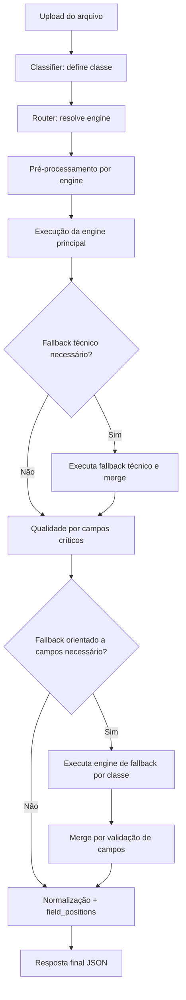
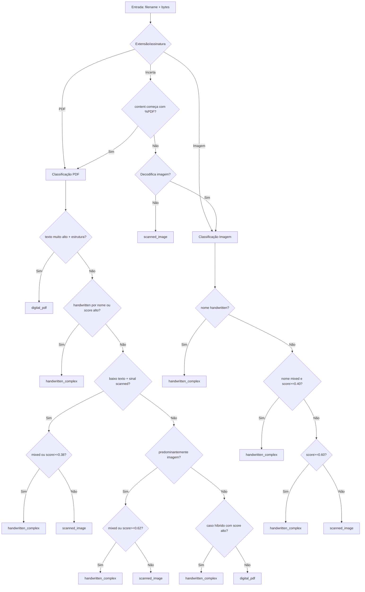
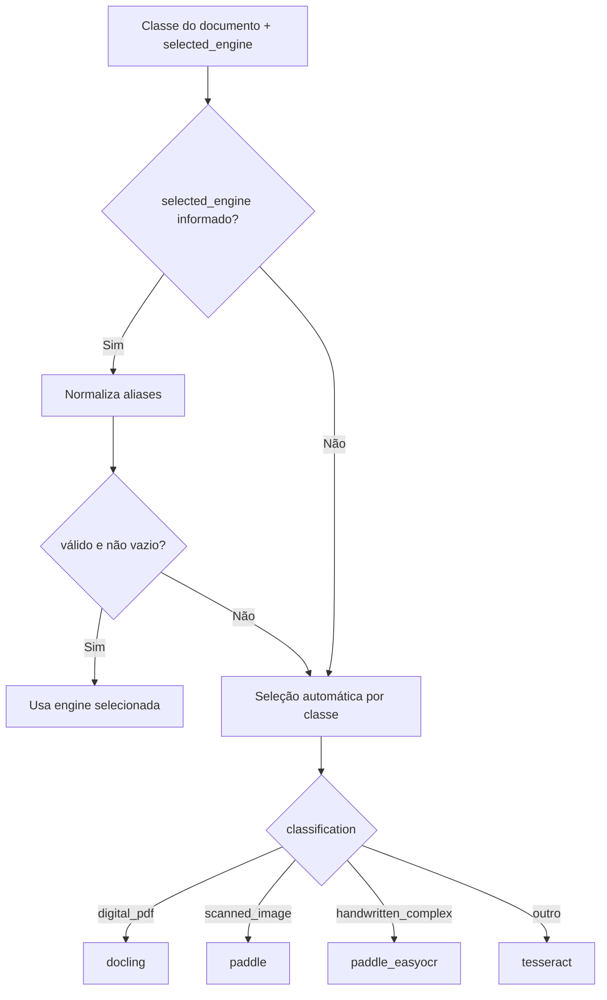
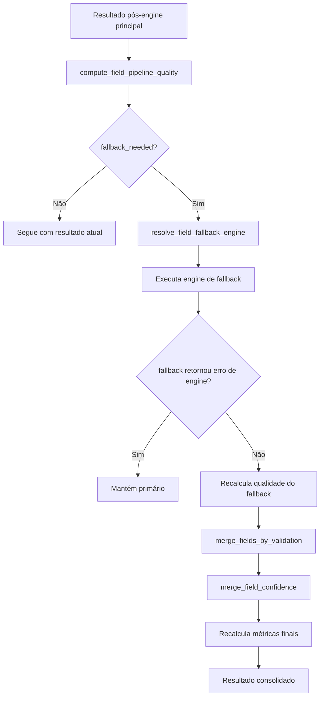

# Regras de Classificação, Escolha de OCR Engine e Fallback (DocuParse)

## Objetivo

Este documento descreve, de forma **minuciosa, didática e fiel ao código atual**, as regras do pipeline de decisão do backend OCR:

1. Classificação da classe do documento;
2. Escolha da OCR Engine principal;
3. Estratégias de fallback (técnico por engine e orientado a campos críticos).

Escopo baseado em:
- `docuparse-project/backend-ocr/agent/classifier.py`
- `docuparse-project/backend-ocr/agent/router.py`
- `docuparse-project/backend-ocr/utils/ocr_fallback.py`
- `docuparse-project/backend-ocr/utils/validate_fields.py`

---
## 1) Visão geral do pipeline decisório

---

## 2) Etapa de classificação (`classifier.py`)

A classificação final sempre retorna uma destas classes:
- `digital_pdf`
- `scanned_image`
- `handwritten_complex`

### 2.1. Estratégia de decisão em camadas

A função `classify_document(filename, content)` segue esta ordem:

1. **Detecta extensão** (`_infer_extension`) por nome e, se necessário, assinatura (`%PDF`);
2. **Extrai sinais semânticos do nome** (`_extract_name_signals`):
   - `handwritten` (ex.: manuscrito, assinatura)
   - `scanned` (ex.: scan, digitalizado, foto)
   - `table` (ex.: tabela, invoice, extrato)
   - `mixed` (ex.: misto, mixed, complexo)
3. Se for PDF, usa `_classify_pdf`;
4. Se for imagem, usa `_classify_image`;
5. Se extensão for incerta, tenta PDF por assinatura, depois decodificação de imagem;
6. Fallback final conservador: `scanned_image`.

### 2.2. Regras para PDF (`_classify_pdf`)

Para até 2 páginas amostradas, o classificador calcula:
- `text_chars_total` (texto extraível da camada textual PDF);
- `avg_table_score` (força de estrutura tabular);
- `avg_handwriting_score` (proxy de manuscrito/complexidade);
- `image_like_ratio` (proporção de páginas com característica “imagem”).

#### Ordem de decisão (exata do código)

1. **Guarda de alta confiança para PDF digital estruturado** → `digital_pdf` quando:
   - `text_chars_total >= 800`
   - `image_like_ratio <= 0.25`
   - (`avg_table_score >= 0.015` **ou** sinal de nome `table`)
   - e **não** houver sinal `handwritten`

2. **Sinal forte de manuscrito/complexidade** → `handwritten_complex` quando:
   - sinal de nome `handwritten`, **ou**
   - `avg_handwriting_score >= 0.68` e `text_chars_total < 900`

3. **PDF digital com estrutura/tabular** → `digital_pdf` quando:
   - `text_chars_total >= 60`
   - `avg_table_score >= 0.030`
   - `avg_handwriting_score < 0.62`

4. **PDF com texto digital significativo e baixa complexidade** → `digital_pdf` quando:
   - `text_chars_total >= 120`
   - `avg_handwriting_score < 0.58`

5. **PDF com baixo texto + sinal de escaneado** (`scanned`) e `text_chars_total < 80`:
   - se (`mixed` **ou** `avg_handwriting_score >= 0.38`) → `handwritten_complex`
   - caso contrário → `scanned_image`

6. **PDF predominantemente imagem** quando `text_chars_total < 40` e `image_like_ratio >= 0.5`:
   - se (`mixed` **ou** `avg_handwriting_score >= 0.62`) → `handwritten_complex`
   - caso contrário → `scanned_image`

7. **Casos híbridos**:
   - se (`mixed` e `avg_handwriting_score >= 0.56`) **ou** `avg_handwriting_score >= 0.62`
   - então → `handwritten_complex`

8. **Padrão final PDF**: `digital_pdf`.

9. **Se der erro no parsing PDF**:
   - se nome indicar `handwritten` ou `mixed` → `handwritten_complex`
   - senão → `scanned_image`.

### 2.3. Regras para imagem (`_classify_image`)

1. Se não decodificar imagem:
   - se sinal de nome `handwritten` ou `mixed` → `handwritten_complex`
   - senão → `scanned_image`

2. Se nome indicar `handwritten` → `handwritten_complex`

3. Se nome indicar `mixed` e `handwriting_score >= 0.40` → `handwritten_complex`

4. Se `handwriting_score >= 0.60` → `handwritten_complex`

5. Caso contrário → `scanned_image`

### 2.4. Diagrama da classificação

---

## 3) Escolha da OCR Engine principal (`router.py`)

A função `_resolve_engine(classification, selected_engine)` decide a engine final.

### 3.1. Prioridade da engine escolhida pelo usuário

Se `selected_engine` for informado (e não for vazio/none/null), ele tem prioridade após normalização de aliases:

- `paddleocr` / `paddle_ocr` → `paddle`
- `llama-parse` → `llamaparse`
- `deepseek-ocr` → `deepseek`
- `hybrid` → `paddle_easyocr`
- `paddle_deepseek` → `paddle_easyocr`

### 3.2. Seleção automática por classe (quando usuário não força engine)

- `digital_pdf` → `docling`
- `scanned_image` → `paddle`
- `handwritten_complex` → `paddle_easyocr`
- fallback final de roteamento → `tesseract`

### 3.3. Diagrama da escolha da engine

---

## 4) Fallback técnico por engine (durante execução principal)

Após escolher a engine, o `router.py` aplica regras específicas.

### 4.1. `easyocr`

- Tenta processar com EasyOCR.
- Se `ModuleNotFoundError` ou `RuntimeError` (engine indisponível):
  - fallback para `tesseract`;
  - adiciona metadado textual em `raw_text_fallback`.

### 4.2. `paddle`

- Processa com PaddleOCR.
- Se `should_trigger_fallback(data)` for verdadeiro, tenta `easyocr`.
- Se fallback EasyOCR falhar, mantém resultado do Paddle com indicação de indisponibilidade.

### 4.3. `paddle_easyocr` (fluxo híbrido)

- Executa PaddleOCR primeiro.
- Se `should_trigger_fallback(paddle_data)` for verdadeiro:
  - tenta EasyOCR como fallback híbrido;
  - se EasyOCR retornar erro de engine (`is_engine_error_fallback`), mantém Paddle;
  - se EasyOCR indisponível/exceção, mantém Paddle e registra motivo.

### 4.4. `deepseek`

- Se `DeepSeekEngine.is_available()` for falso:
  - fallback para `tesseract`.
- Se disponível, usa DeepSeek normalmente.

### 4.5. `docling`

- Processa com Docling.
- Se `should_trigger_fallback(data)` for verdadeiro, fallback para `llamaparse`.

### 4.6. `llamaparse`

- Sem fallback técnico específico no bloco dedicado; executa direto.

### 4.7. Exceções globais de execução

- `pytesseract.TesseractNotFoundError`: resposta resiliente com texto de orientação.
- `FileNotFoundError`/`OSError`: resposta resiliente indicando OCR indisponível.
- Exceção genérica: retorna mock com `raw_text_fallback` de erro.

---

## 5) Regra `should_trigger_fallback` (gatilho técnico)

A função `should_trigger_fallback` dispara fallback se **qualquer** condição abaixo for verdadeira:

1. **Baixa confiança média OCR**: `avg_confidence < 70`;
2. **Qualidade de campos crítica insuficiente**: `compute_field_pipeline_quality(...).fallback_needed == True`;
3. **Baixa cobertura textual** (`_has_low_text_coverage`):
   - texto total baixo (`text_length < 80`), ou
   - densidade baixa por página em PDF multipágina (`chars_per_page < 90`), ou
   - poucos tokens (`token_count < 15`).

---

## 6) Fallback orientado a campos críticos (pós-engine principal)

Mesmo após o fallback técnico, o router executa validação semântica dos campos críticos.

### 6.1. Campos críticos analisados

Obrigatórios (`REQUIRED_FIELDS`):
- `fornecedor`
- `tomador`
- `cnpj_fornecedor`
- `numero_nf`
- `descricao_servico`
- `valor_nf`
- `retencao`

Adicional:
- `cnpj_tomador`

### 6.2. Métricas de qualidade

A função `compute_field_pipeline_quality` calcula:
- `field_score`: taxa de validações booleanas aprovadas;
- `ocr_confidence`: confiança OCR normalizada em [0,1];
- `final_score`: combinação ponderada

\[
\text{final\_score} = 0.4 \cdot \text{ocr\_confidence} + 0.6 \cdot \text{field\_score}
\]

### 6.3. Quando `fallback_needed` vira verdadeiro

`fallback_needed = True` se houver ao menos um cenário:

1. **Campo crítico inválido** (`cnpj_fornecedor`, `valor_nf`, `numero_nf`);
2. **Campo obrigatório ausente**;
3. **Campo crítico com baixa confiança** (`tomador`, `cnpj_fornecedor`, `numero_nf`, `valor_nf` abaixo dos thresholds por campo);
4. **`final_score < 0.85`**.

### 6.4. Engine de fallback orientado a campos (`resolve_field_fallback_engine`)

Preferência por classe:
- `digital_pdf` → `llamaparse`
- `scanned_image` → `easyocr`
- `handwritten_complex` → `easyocr`

Regra de colisão (quando candidata = engine primária): usa alternativa:
- `llamaparse` ↔ `docling`
- `easyocr` → `tesseract`
- `deepseek` → `paddle`
- `paddle` → `easyocr`
- `tesseract` → `easyocr`

Normalização adicional: se primária for `paddle_deepseek` ou `paddle_easyocr`, ela é tratada como `paddle` para comparação.

### 6.5. Merge dos campos (primário + fallback)

No merge (`merge_fields_by_validation`):
- usa valor do fallback se ele for **válido**, ou
- usa valor do fallback se o valor primário estiver **vazio**.

Depois, a confiança por campo também é mesclada apenas para os campos substituídos.

### 6.6. Diagrama do fallback orientado a campos

---

## 7) Matriz resumida (classificação → engine principal → fallback)

| Classe | Engine principal (automática) | Fallback técnico mais comum | Fallback orientado a campos |
|---|---|---|---|
| `digital_pdf` | `docling` | `llamaparse` (quando trigger) | `llamaparse` (ou `docling` se colisão) |
| `scanned_image` | `paddle` | `easyocr` (quando trigger) | `easyocr` (ou `tesseract` se colisão) |
| `handwritten_complex` | `paddle_easyocr` | `easyocr` (híbrido, condicionado a trigger) | `easyocr` (comparando primária normalizada como `paddle`) |

> Observação prática: no caminho de `handwritten_complex`, o código atual privilegia **Paddle + EasyOCR** no fluxo híbrido e também no fallback orientado a campos.

---

## 8) Conclusão operacional

A arquitetura implementa uma estratégia em camadas:

1. **Classificação robusta por múltiplos sinais** (nome + estrutura + visão computacional);
2. **Roteamento determinístico de engine**, com possibilidade de override do usuário;
3. **Fallback técnico por qualidade/disponibilidade** da engine;
4. **Fallback semântico orientado a campos críticos** para elevar precisão final;
5. **Merge validado de resultados**, preservando rastreabilidade (`source`, `fallback_engine`, `fields_from_fallback`, `ocr_meta`).

Esse desenho reduz falhas em documentos reais heterogêneos (PDF digital, escaneado e manuscrito/misto), mantendo robustez e observabilidade do pipeline.