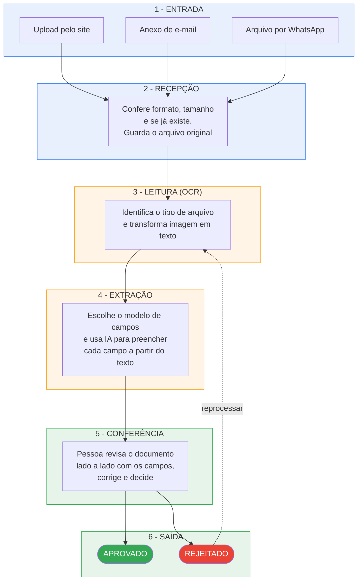
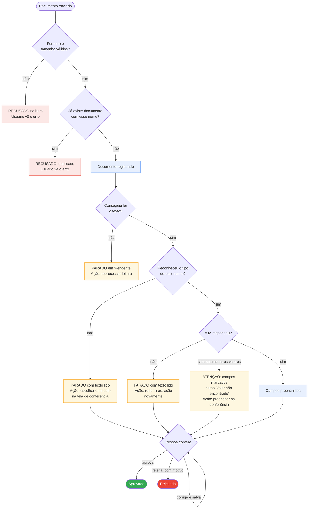
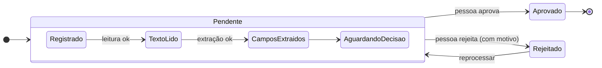

# DocuParse — Como o sistema funciona (visão geral)

> **Para quem é este documento:** qualquer pessoa que precise entender o DocuParse sem ter
> participado do desenvolvimento — produto, operação, suporte, novos integrantes do time.
>
> Aqui não há código, nomes de arquivo ou detalhes de implementação. Se você precisa desse nível,
> veja [fluxo-aplicacao.md](fluxo-aplicacao.md).
>
> **Atualizado em:** 2026-07-27

---

## 1. O que o DocuParse faz, em três frases

O DocuParse recebe documentos (notas fiscais, boletos, contas de água, recibos), **lê o texto**
deles automaticamente, **identifica os campos importantes** (valor, CNPJ, número da nota, data…) e
apresenta tudo a uma pessoa para **conferência e aprovação**.

O objetivo é substituir a digitação manual: o sistema faz o trabalho pesado e o humano só confere
e corrige o que estiver errado.

Nada é aprovado sem uma pessoa decidir. O sistema **nunca aprova sozinho**.

---

## 2. O mapa do processo

### 2.1 Visão geral — o caminho completo

**Legenda de cores:** 🔵 azul = entrada e recepção · 🟡 amarelo = processamento automático ·
🟢 verde = ação humana e resultado.

### 2.2 O que acontece quando algo dá errado

O sistema foi desenhado para **parar em um estado seguro e visível**, nunca para descartar o
documento em silêncio. Cada desvio abaixo deixa o documento parado numa etapa, aguardando ação.

**Como ler:** vermelho = recusado na entrada (o usuário vê o erro na hora) · amarelo = documento
parado, esperando uma ação · azul = seguiu adiante · verde/vermelho no fim = decisão registrada.

**Regra de ouro:** erro na entrada = **rejeição imediata e visível**. Erro no processamento =
**documento parado, esperando uma ação** — nunca perdido.

---

## 3. Quem faz o quê

O sistema é dividido em partes independentes, cada uma com uma única responsabilidade:

| Parte | Responsabilidade | Analogia |
|---|---|---|
| **Portaria** | Recebe os arquivos pelos três canais, confere o básico e guarda o original | O recepcionista que protocola a entrega |
| **Coordenação** | É o único que sabe o estado de cada documento e comanda as demais etapas | O gerente do processo |
| **Leitura** | Converte o arquivo em texto | O leitor que transcreve |
| **Extração** | A partir do texto, preenche os campos do formulário | O analista que preenche a planilha |
| **Interface** | Onde a pessoa envia, acompanha, confere e decide | A mesa de trabalho |
| **Arquivo** | Guarda os arquivos originais e o texto lido | O arquivo morto |

Duas consequências importantes desse desenho:

- **A Leitura e a Extração não guardam nada.** Elas recebem uma entrada, devolvem uma saída e
  esquecem. Só a Coordenação sabe em que pé está cada documento.
- **A Portaria não sabe o que é o documento.** Ela só valida o básico e protocola. Toda a
  inteligência vem depois.

---

## 4. As etapas, uma a uma

### Etapa 1 — Entrada

| Aspecto | Descrição |
|---|---|
| **O que entra** | Um arquivo: PDF, JPEG, PNG, TIFF ou WEBP |
| **De onde** | Upload no site · anexo de e-mail (caixa monitorada ou webhook) · arquivo enviado por WhatsApp |
| **O que sai** | O arquivo protocolado, com um número único |

**O que é conferido, nesta ordem:** o formato está na lista permitida? O arquivo não está vazio?
Está dentro do tamanho máximo? Já existe um documento com esse mesmo nome de arquivo?

> ⚠️ **Ponto de atenção:** a checagem de duplicidade é **pelo nome do arquivo**, não pelo
> conteúdo. Dois arquivos idênticos com nomes diferentes entram como documentos separados; e
> reenviar um arquivo com um nome já usado é recusado, mesmo sendo outro documento.

**Se falhar:** o usuário recebe a recusa **imediatamente**, com o motivo. Nada é registrado.

---

### Etapa 2 — Recepção

| Aspecto | Descrição |
|---|---|
| **O que entra** | O arquivo aprovado na etapa 1 |
| **O que acontece** | O original é guardado no arquivo digital e o documento é registrado como **Pendente** |
| **O que sai** | Um documento visível na caixa de entrada, ainda sem texto e sem campos |

O usuário já vê o documento na lista neste momento. As etapas seguintes acontecem em segundo
plano, e a tela se atualiza sozinha enquanto houver documentos em processamento.

> ⚠️ **Ponto de atenção:** se a Coordenação estiver fora do ar no momento exato do envio, o
> arquivo é guardado mas **pode não aparecer na caixa de entrada**. É a única situação em que um
> documento enviado com sucesso não fica visível. Sintoma: o usuário vê "documento recebido" mas
> ele não surge na lista.

---

### Etapa 3 — Leitura (OCR)

| Aspecto | Descrição |
|---|---|
| **O que entra** | O arquivo original |
| **O que sai** | O texto do documento e a indicação de que tipo de arquivo era |

Esta é a etapa mais variável do processo, porque documentos chegam de formas muito diferentes.
O sistema classifica cada arquivo em uma de três categorias e escolhe a técnica adequada:

| Categoria | O que é | Como é lido |
|---|---|---|
| **PDF digital** | Gerado por computador, já tem texto por dentro | Extração direta do texto — rápido e preciso |
| **Imagem escaneada** | Foto ou digitalização de papel | Leitura por inteligência artificial de visão |
| **Manuscrito / complexo** | Contém escrita à mão, assinaturas, layout difícil | Leitura por IA de visão, com tratamento reforçado |

**Como o sistema se protege:**

- Se a técnica escolhida falhar, ele **tenta automaticamente uma alternativa** e registra qual foi usada.
- Caso clássico: um PDF que *parece* digital mas é, na verdade, uma foto escaneada. A leitura
  direta volta vazia e o sistema **percebe, reclassifica e refaz** com IA de visão.

**Se falhar mesmo assim:** o documento fica parado como **Pendente**, sem texto. Ação disponível
na tela: **reprocessar a leitura**.

---

### Etapa 4 — Extração dos campos

| Aspecto | Descrição |
|---|---|
| **O que entra** | O texto lido na etapa anterior |
| **O que sai** | Os campos preenchidos (valor, CNPJ, número da nota…) com um grau de confiança |

Duas decisões acontecem aqui.

**Decisão 1 — qual modelo de campos usar?** Cada tipo de documento tem seu próprio conjunto de
campos. O sistema decide nesta ordem:

1. **Configuração explícita do administrador** para aquele tipo de documento — sempre vence.
2. **Reconhecimento automático pelo texto**: procura marcas típicas de nota fiscal, depois de
   conta de água, depois de boleto.
3. **Regra de reserva** por tipo de documento, para modelos personalizados.

Se nenhuma funcionar, o documento fica parado **com o texto já lido**, e o operador escolhe o
modelo manualmente na tela de conferência.

**Decisão 2 — o preenchimento.** O texto e a lista de campos esperados são enviados a um modelo de
IA, que devolve cada campo preenchido.

**Se a IA não achar um valor**, ela não inventa: o campo volta marcado como
**"Valor não encontrado"** e aparece assim na conferência, para a pessoa preencher.

**Se a IA falhar ou estiver indisponível**, o documento fica parado após a leitura, com o motivo
registrado e visível. Ação disponível: **rodar a extração novamente**, escolhendo o modelo.

---

### Etapa 5 — Conferência humana

| Aspecto | Descrição |
|---|---|
| **O que entra** | O documento com texto lido e campos preenchidos |
| **O que sai** | Uma decisão: aprovado, rejeitado ou corrigido |

Na tela de conferência a pessoa vê o **documento original lado a lado com os campos extraídos** e
pode:

- **Corrigir, adicionar ou remover campos** e salvar. Cada salvamento vira uma **versão numerada**
  e o histórico completo fica disponível — nada é sobrescrito de forma irrecuperável.
- **Aprovar** o documento.
- **Rejeitar**, informando obrigatoriamente o **motivo**.

**Três regras protegem esta etapa:**

| Regra | Por quê |
|---|---|
| Não é possível aprovar nem rejeitar um documento **sem extração feita** | Evita decisão sobre um documento em branco |
| A rejeição **exige motivo escrito** | Garante rastreabilidade da recusa |
| Se outra pessoa alterou os campos enquanto você editava, seu salvamento é **bloqueado** com um aviso | Evita que uma edição apague a de outra pessoa sem que ninguém perceba |

---

### Etapa 6 — Saída

| Resultado | O que significa | É definitivo? |
|---|---|---|
| **Aprovado** | Os dados foram conferidos e estão corretos | Sim |
| **Rejeitado** | O documento foi recusado, com motivo registrado | Não — pode ser reprocessado desde a leitura |

> ℹ️ **Estado atual:** o envio automático dos documentos aprovados para um ERP externo está
> **construído mas não ligado**. Hoje o fluxo termina em "Aprovado" dentro do DocuParse; a saída
> para sistemas externos ainda depende de um passo manual.

---

## 5. Os estados de um documento

Na tela, os documentos aparecem com três rótulos apenas — **Pendente**, **Aprovado** e
**Rejeitado**. "Pendente" agrupa todos os estágios intermediários:

| O que você vê | O que está acontecendo por trás | O que fazer |
|---|---|---|
| Pendente (acabou de chegar) | Registrado, leitura em andamento | Aguardar |
| Pendente (parado, sem texto) | A leitura falhou | Reprocessar a leitura |
| Pendente (com texto, sem campos) | Não reconheceu o tipo, ou a extração falhou | Abrir e escolher o modelo, rodar a extração |
| Pendente (com campos) | Pronto para conferência | Conferir e decidir |
| Aprovado / Rejeitado | Decisão registrada | — |

---

## 6. Tabela rápida de problemas

| Sintoma | Causa provável | O que fazer |
|---|---|---|
| "O Documento X já existe" no envio | Já há um documento com esse **nome de arquivo** | Renomear o arquivo ou verificar se é mesmo repetido |
| Envio recusado por formato | Extensão fora da lista permitida | Converter para PDF, JPEG, PNG, TIFF ou WEBP |
| Envio recusado por tamanho | Arquivo acima do limite | Reduzir ou dividir o arquivo |
| Enviou, mas não aparece na lista | Falha de comunicação interna no momento do envio | Reenviar; se persistir, é problema de infraestrutura |
| Fica "Pendente" e nunca mostra texto | A leitura falhou | Reprocessar a leitura |
| Tem texto, mas nenhum campo | Tipo de documento não reconhecido, ou IA indisponível | Abrir, escolher o modelo, rodar a extração |
| Todos os campos dizem "Valor não encontrado" | A IA não localizou os valores — ou está sem configuração de acesso | Preencher manualmente; se for sistemático, é configuração |
| Não consegue aprovar | O documento não tem extração feita | Rodar a extração antes de decidir |
| "A lista foi atualizada por outro processo" | Outra pessoa salvou campos enquanto você editava | Recarregar a versão atual e refazer a edição |
| Documento demora muito | Fila de processamento cheia (poucos documentos em paralelo por vez) | Aguardar |

---

## 7. Coisas importantes de saber

**Separação entre clientes.** Cada cliente (tenant) tem seus dados completamente isolados — um
nunca enxerga documentos do outro. Usuários pertencem a um cliente, e administradores podem
alternar entre clientes quando têm permissão para isso.

**Permissões.** O que cada pessoa vê e pode fazer é controlado por papéis: enviar documentos, ver
a caixa de entrada, conferir e decidir, acessar operações, administrar usuários, papéis e
clientes. Quem não tem a permissão não vê o menu correspondente.

**Nada é aprovado automaticamente.** Toda aprovação passa por uma pessoa, mesmo quando a IA
devolve confiança alta.

**Histórico preservado.** Toda alteração de campos é versionada e o histórico é consultável. As
decisões ficam registradas com autor, data e motivo.

**Processamento em segundo plano.** Leitura e extração não travam a tela: o documento aparece
imediatamente e evolui sozinho. A contrapartida é que uma falha nessas etapas **não gera um alerta
para o usuário** — ela se manifesta como um documento que "não avança". Por isso a tabela da
seção 6 é importante para a operação.

**Capacidade.** Os documentos são processados alguns por vez, não todos simultaneamente. Um lote
grande é processado em fila, na ordem de chegada.

---

## 8. Limites conhecidos hoje

| Limite | Impacto prático |
|---|---|
| Duplicidade é verificada pelo **nome do arquivo**, não pelo conteúdo | O mesmo documento com dois nomes entra duas vezes |
| A **saída para ERP** existe mas não está ligada | Documentos aprovados não são enviados automaticamente a sistemas externos |
| Falhas de processamento **não notificam ninguém** | Dependem de alguém observar a caixa de entrada |
| O reconhecimento automático de tipo cobre **nota fiscal, conta de água e boleto** | Outros tipos exigem configuração de modelo pelo administrador |
| A leitura por IA depende de um serviço externo | Sem ele configurado, os campos voltam vazios (sinalizados, não silenciosos) |

---

## 9. Glossário

| Termo | Significado |
|---|---|
| **OCR / Leitura** | Processo de transformar imagem em texto |
| **Extração** | Preencher campos estruturados (valor, CNPJ…) a partir do texto |
| **Modelo / Schema** | A lista de campos esperados para um tipo de documento e as instruções de como encontrá-los |
| **Layout** | Formato visual reconhecido de um documento (ex.: boleto de determinado banco) |
| **Confiança** | Estimativa de quão certo o sistema está sobre um valor extraído |
| **Versão de campos** | Uma "foto" imutável da lista de campos num momento; cada salvamento cria uma nova |
| **Tenant / Cliente** | Organização cujos dados ficam isolados dos demais |
| **Canal** | Por onde o documento chegou: upload, e-mail ou WhatsApp |
| **Pendente** | Qualquer estágio antes da decisão humana |
| **Reprocessar** | Refazer a leitura do documento desde o arquivo original |
