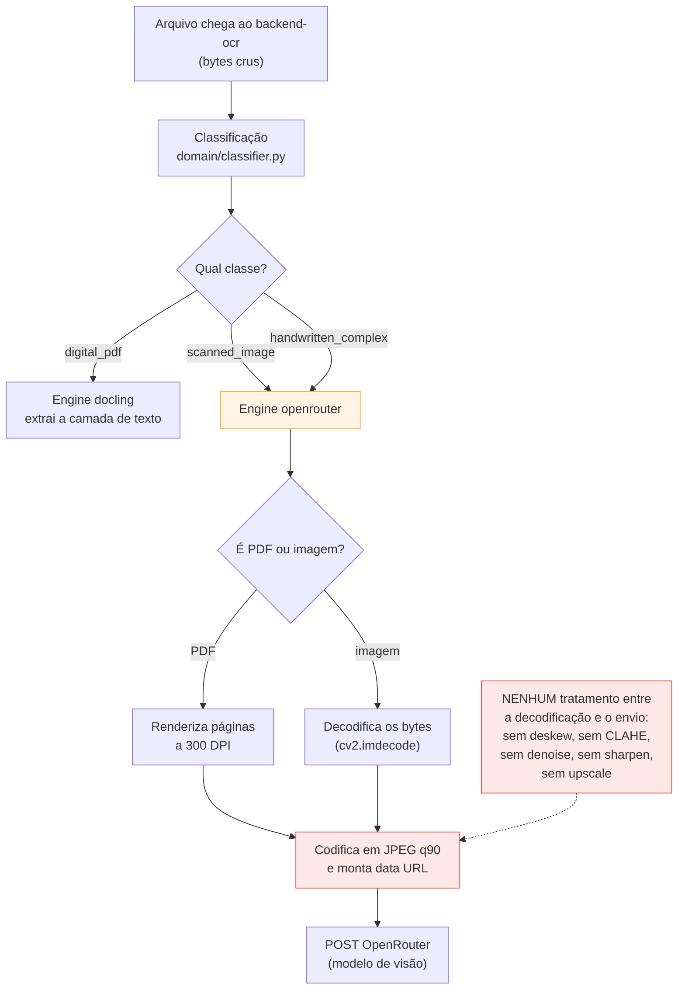

# Análise — Pré-processamento de imagem e avaliação de qualidade no pipeline de OCR

> **Objetivo:** validar, no código em execução, o que acontece com um arquivo que **não** é PDF
> digital (imagem escaneada, foto, manuscrito) entre o upload e a chamada ao modelo de visão.
>
> **Critério adotado:** só conta o que é **efetivamente executado pelo fluxo**. Código existente
> mas nunca alcançado é reportado explicitamente como **morto**.
>
> **Data:** 2026-07-28 · **Base:** branch `015-superlogica-discovery-spike` · serviço `backend-ocr`

---

## 1. Resumo executivo

| # | Pergunta | Resposta | Veredito |
|---|---|---|---|
| 1 | Arquivos que não são PDF digital são processados via OpenRouter (LLM de visão)? | **Sim.** `scanned_image` e `handwritten_complex` vão para o engine `openrouter`. Tesseract só entra como fallback técnico | ✅ Confirmado |
| 2 | Existe pré-processamento da imagem antes de enviar ao OpenRouter? | **Não.** A imagem vai **crua**: apenas decodificada e recodificada em JPEG (qualidade 90) para virar `data:` URL. PDF escaneado é renderizado a 300 DPI e enviado sem tratamento | ❌ Não existe no fluxo |
| 3 | Existe código de pré-processamento que não é executado? | **Sim.** `shared/preprocessing.py` (797 linhas: deskew, CLAHE, correção de iluminação, denoise, sharpen, upscale, warp de perspectiva, recorte de ROI) é **código morto no fluxo** — alcançável apenas por um método que só um script de teste chama | ⚠️ Código morto |
| 4 | Existe verificação de qualidade da imagem? | **Não.** Existem métricas visuais, mas elas servem **só para classificar** o tipo de documento. Nenhum limiar de nitidez, iluminação ou inclinação é avaliado, e nenhuma decisão de tratamento é tomada a partir deles | ❌ Não existe |

**Conclusão em uma frase:** uma foto torta, escura e desfocada é enviada ao modelo de visão
exatamente como chegou — o sistema não mede a qualidade dela nem tenta corrigi-la, e toda a
biblioteca de correção de imagem construída para isso está desconectada do fluxo.

---

## 2. Caminho real de execução (validado)

### 2.1 Da classificação à escolha do engine

O documento é classificado uma única vez em `digital_pdf`, `scanned_image` ou
`handwritten_complex`, e o mapa de engines padrão é fixo no código:

| Classe | Engine executado |
|---|---|
| `digital_pdf` | `docling` (extração da camada de texto) |
| `scanned_image` | **`openrouter`** (LLM de visão) |
| `handwritten_complex` | **`openrouter`** (LLM de visão) |
| classe desconhecida | `tesseract` (último recurso) |

**Confirma a pergunta 1:** tudo que não é PDF digital vai para o OpenRouter. O `tesseract` só é
alcançado quando o engine escolhido lança exceção, ou quando a classificação não mapeia para
nenhuma entrada do dicionário.

> Observação: o override manual de engine (`selected_engine`) existe na API, mas **o frontend não
> envia esse parâmetro** no fluxo automático — o painel de configurações inclusive descreve o perfil
> operacional como "Docling para PDF textual, OpenRouter para imagem/PDF escaneado e Tesseract como
> fallback técnico".

### 2.2 O que exatamente é enviado ao OpenRouter

**Caminho de imagem** (`.jpg`, `.png`, `.tiff`, `.webp`):

1. `cv2.imdecode` converte os bytes em matriz BGR — nada além de decodificar.
2. A matriz vai direto para o montador do payload.
3. `cv2.imencode(".jpg", …, JPEG_QUALITY=90)` + Base64 → `data:image/jpeg;base64,…`.
4. `POST` para o endpoint de chat-completions com a instrução de OCR.

**Caminho de PDF sem camada de texto:**

1. Cada página é renderizada a **300 DPI** com PyMuPDF (matriz BGR).
2. Mesma codificação JPEG q90 → data URL.
3. Uma chamada ao modelo **por página**.

**Entre os passos 1 e 3 não há nenhuma operação de imagem.** Não há rotação, correção de
perspectiva, equalização de iluminação, remoção de ruído, aumento de nitidez, binarização,
redimensionamento nem recorte da área do documento.

**Confirma a pergunta 2:** a imagem é enviada crua.

### 2.3 O que existe de tratamento real no fluxo hoje

Para ser justo com o que está vivo:

| Tratamento | Onde | Quando roda |
|---|---|---|
| Renderização de PDF a 300 DPI | engine openrouter | PDF sem camada de texto — é conversão, não melhoria |
| Recompressão JPEG (q90) | engine openrouter | sempre, para montar o data URL — pode **piorar** levemente a imagem |
| Variantes de binarização (resize 1.5×, blur gaussiano, Otsu, threshold adaptativo, inversão) | engine tesseract | **só quando o Tesseract roda**, ou seja, no fallback técnico |
| Nova tentativa com modelo alternativo quando o texto volta vazio | engine openrouter | sempre que a resposta vem sem texto, ou quando o modelo primário não aceita imagem |
| Remoção de repetições em loop e recuperação de JSON truncado | engine openrouter | pós-processamento do texto devolvido pelo LLM |

Nenhum desses é pré-processamento de qualidade de imagem no caminho do OpenRouter. O único
pré-processamento de imagem realmente executado no sistema é o do Tesseract — e ele é interno ao
engine, genérico, e não usa a biblioteca compartilhada.

---

## 3. Verificação de qualidade da imagem

**Não existe.** Nenhum ponto do fluxo pergunta "esta imagem está boa o suficiente?".

O que existe é uma extração de **features visuais para classificação**, que roda sobre a imagem (ou
sobre páginas amostradas do PDF):

| Métrica calculada | Para que serve hoje |
|---|---|
| `edge_density` (densidade de bordas, Canny) | compor os scores abaixo |
| `line_density` (linhas retas, Hough) | distinguir documento impresso/tabular de manuscrito |
| `table_score` (linhas horizontais/verticais por morfologia) | reforçar a decisão de `digital_pdf` |
| `handwriting_score` (proxy de traço irregular / baixa linearidade) | decidir `handwritten_complex` |
| `is_image_like` | contar páginas que parecem imagem dentro de um PDF |

Esses números respondem **"que tipo de documento é este?"** — nunca **"esta imagem está legível?"**.
Não há métrica de nitidez (variância do laplaciano sobre a imagem inteira), de exposição/iluminação,
de contraste global, de ângulo de inclinação, nem de resolução mínima. Consequentemente, também não
há limiar, alerta ao usuário, rejeição de arquivo ilegível ou rota alternativa para imagem ruim.

> Nuance: existe cálculo de variância do laplaciano em `shared/preprocessing.py`, mas dentro de
> funções de segmentação de manuscrito que **não são chamadas pelo fluxo** (ver §4).

**Confirma a pergunta 4:** não há verificação de qualidade.

---

## 4. Inventário de código morto

Todos os itens abaixo foram verificados: existem, compilam, têm testes em alguns casos — e **não são
alcançados pelo fluxo de processamento**.

### 4.1 A biblioteca de pré-processamento (`shared/preprocessing.py`, 797 linhas)

Contém exatamente o que a pergunta original descreve como necessário:

| Função | O que faria |
|---|---|
| `deskew_simple` | corrigir documento torto |
| `warp_perspective_if_photo` | corrigir foto tirada em ângulo |
| `equalize_illumination` | corrigir iluminação irregular |
| `apply_clahe_local_contrast` | melhorar contraste local |
| `denoise_light` / `denoise_moderate` | remover ruído |
| `sharpen_moderate` | aumentar nitidez |
| `upscale_if_low_resolution` | ampliar imagem de baixa resolução |
| `crop_document_roi` / `crop_margins_light` | recortar a área útil do documento |
| `preprocess_scanned` / `preprocess_photo` / `preprocess_handwritten` | pipelines completos por tipo |
| `preprocess_for_paddle_engine` / `_easyocr_` / `_deepseek_` / `_docling_` / `_llamaparse_` / `_trocr_` | pipelines por engine |

**Por que está morto:** o único ponto de entrada que aplica esses pipelines é o método
`process_with_classification(image_bytes, classification)`, implementado em vários engines. O
pipeline de produção **nunca chama esse método** — ele chama `engine.process(file_bytes, metadata)`.
A única chamada a `process_with_classification` em todo o repositório está em um script de teste
manual (`backend-ocr/tests/run_tesseract_workflow.py`).

Além disso, os pipelines por engine (`preprocess_for_paddle_engine`, `preprocess_for_easyocr_engine`,
etc.) pertencem a engines que também não são alcançáveis (§4.2), e **não existe
`preprocess_for_openrouter_engine`** — o engine efetivamente usado nunca teve um pipeline associado.

### 4.2 Engines fora do perfil operacional

`paddle`, `easyocr`, `deepseek`, `trocr` e `llamaparse` são registrados na inicialização, mas:

- não aparecem no mapa de engines padrão (`digital_pdf`/`scanned_image`/`handwritten_complex`);
- não constam da tabela de capacidades que alimenta a listagem de engines da API;
- só seriam alcançados por uma chamada direta à API com `selected_engine`, que o frontend não faz.

Na prática são **inacessíveis pelo produto**. Como boa parte do pré-processamento vive dentro desses
engines, esse código morre junto.

### 4.3 As "dicas de pré-processamento" (`preprocessing_hint`)

O classificador mantém um dicionário por classe e engine com valores como
`natural_rgb_with_clahe_and_light_deskew`, `denoise_contrast_deskew_upscale` e, para o caminho vivo,
`render_pdf_or_image_for_vision_ocr`.

Esses valores são resolvidos, colocados na resposta da API e propagados até o
`raw_text.json` guardado pelo backend-core. **Nenhum engine lê esse campo.** São strings
descritivas — documentam a intenção de um tratamento que não acontece. O nome sugere execução; o
comportamento é apenas informativo.

### 4.4 Configuração de OCR por tenant que não é aplicada

O backend-core expõe uma tela e uma API de configurações de OCR com os campos `digital_pdf_engine`,
`scanned_image_engine`, `handwritten_engine`, `technical_fallback_engine`, `openrouter_model`,
`openrouter_fallback_model`, `timeout_seconds`, `retry_empty_text_enabled` e
`digital_pdf_min_text_blocks`.

Esses valores são **gravados e devolvidos, mas nunca lidos pelo pipeline**: o serviço que dispara o
OCR não importa esse modelo e chama o backend-ocr sem passar engine, timeout ou modelo. As decisões
reais vêm do dicionário fixo no código do backend-ocr e das variáveis de ambiente
(`OPENROUTER_MODEL`, `OPENROUTER_FALLBACK_MODEL`).

Impacto direto na pergunta original: **mudar o engine de "imagem escaneada" na tela de configurações
não altera o processamento**. E `retry_empty_text_enabled` descreve um comportamento que existe no
engine, mas está sempre ligado, sem consultar a configuração.

---

## 5. Impacto prático

| Cenário | O que acontece hoje |
|---|---|
| Foto torta (documento em ângulo) | Vai crua ao LLM. Modelos de visão toleram rotação moderada, mas a leitura degrada em ângulos maiores; não há correção nem aviso |
| Iluminação irregular / sombra | Vai crua. Regiões escuras tendem a virar texto omitido — que aparece como campo `"Valor não encontrado"` na conferência |
| Foco ruim / desfoque | Vai cru. Sem métrica de nitidez, não é possível distinguir "documento ilegível" de "modelo falhou" |
| Baixa resolução | Vai crua, sem upscale. A recompressão JPEG q90 ainda adiciona uma perda |
| Ruído / documento amassado | Vai cru, sem denoise |
| PDF escaneado grande | Renderizado a 300 DPI sem limite de dimensão; em A4 são ~2480×3508 px por página, e o Base64 resultante infla o payload em ~33%. Uma chamada por página |

**Consequência para o diagnóstico:** quando a extração falha por qualidade, o sistema não tem como
dizer isso. O sintoma chega ao operador como campos vazios, indistinguível de um documento em que a
informação realmente não existe.

**Atenuante real:** a nova tentativa automática com modelo alternativo quando o texto volta vazio
cobre parte dos casos de falha — mas ataca o modelo, não a imagem. Se a imagem é o problema, os dois
modelos recebem a mesma imagem ruim.

---

## 6. Se for decidido tratar isso

Opções em ordem de custo/benefício, apenas como referência para a discussão:

1. **Medir antes de agir.** Adicionar métricas de qualidade (nitidez por variância do laplaciano,
   brilho/contraste, ângulo estimado, resolução) no momento da classificação e **gravá-las nos
   metadados** do documento, sem alterar o processamento. Custo baixo, e passa a ser possível
   correlacionar extrações ruins com imagens ruins — hoje isso é invisível.
2. **Ligar um pipeline mínimo para o OpenRouter.** Criar o equivalente a
   `preprocess_for_openrouter_engine` reaproveitando funções que já existem e estão testadas
   (`deskew_simple`, `equalize_illumination`, `apply_clahe_local_contrast`,
   `upscale_if_low_resolution`) e aplicá-lo no caminho de imagem e no de página renderizada.
   Recomendável validar em amostra: LLMs de visão às vezes lidam melhor com a imagem natural do que
   com uma binarizada agressivamente.
3. **Limitar a dimensão enviada.** Definir um lado máximo (ex.: 2000 px) antes da codificação,
   reduzindo payload e custo por página sem perda relevante de leitura.
4. **Decidir o destino do código morto.** Ou conectar `shared/preprocessing.py` ao fluxo, ou
   removê-lo/marcá-lo explicitamente como experimental. Manter 797 linhas de tratamento de imagem
   que ninguém executa sugere, para quem lê o repositório, uma capacidade que o produto não tem.
5. **Aplicar as configurações de OCR por tenant, ou removê-las da tela.** Hoje a interface promete
   um controle que não existe.

---

## 7. Evidências

| Afirmação | Onde verificar |
|---|---|
| Imagem escaneada e manuscrito vão para o OpenRouter | `backend-ocr/domain/engine_resolver.py` — mapa `ENGINE_DEFAULTS` |
| O pipeline chama `engine.process(bytes, metadata)` | `backend-ocr/application/process_document.py:134` |
| Imagem é apenas decodificada antes do envio | `backend-ocr/infrastructure/engines/openrouter_engine.py:639` (`_process_image`) |
| Codificação JPEG q90 → data URL, sem tratamento | `openrouter_engine.py:146` (`_to_data_url`) |
| PDF renderizado a 300 DPI, sem tratamento | `openrouter_engine.py:129` e `:549` |
| Biblioteca de pré-processamento não é chamada pelo fluxo | `shared/preprocessing.py` (797 linhas) × única chamada em `backend-ocr/tests/run_tesseract_workflow.py:76` |
| `preprocessing_hint` é apenas informativo | `domain/classifier.py:39` (dicionário) e `application/process_document.py:120-123, 226-239` (só compõe a resposta) |
| Features visuais servem só para classificar | `domain/classifier.py:411` (`_extract_visual_features`) |
| Tesseract aplica variantes próprias | `backend-ocr/infrastructure/engines/tesseract_engine.py:55` (`_build_variants`) |
| Configurações de OCR não chegam ao pipeline | `backend-core/documents/models.py:229` (modelo) × `backend-core/documents/services/ocr_processor.py` (não importa `OCRSettings`) |
| Frontend não envia `selected_engine` | busca por `selected_engine` em `frontend/src/` — sem ocorrências no fluxo de upload |
