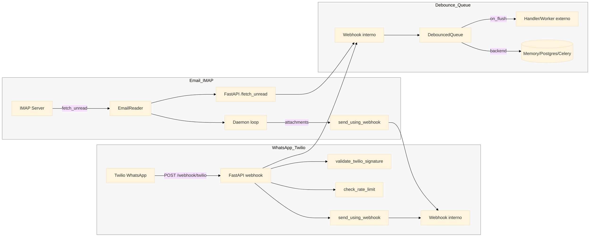

# Fluxo geral - Backend Com (WhatsApp, Email, Debounce)

Este arquivo contem um diagrama do fluxo atual, do inbound ao processamento interno.

## Observacoes

- O webhook interno representa o ponto de handoff para o processamento assincro.
- O handler/worker externo nao esta implementado neste modulo, mas e o destino final dos payloads.
- DebouncedQueue e opcional e depende de como o webhook interno foi implementado no sistema externo.
