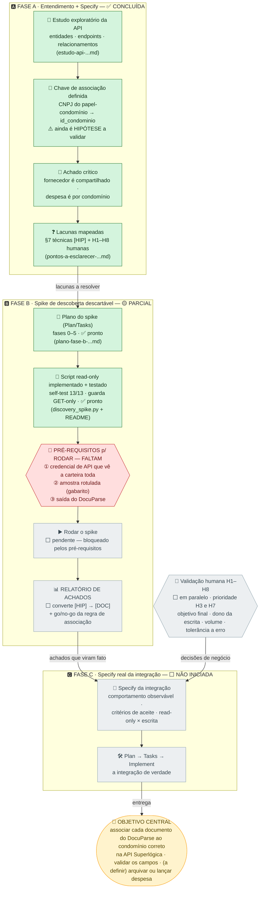

# 🗺️ Roadmap visual — DocuParse × API Superlógica

Passo a passo resumido das fases **A → B → C** rumo ao objetivo central, com o que já foi feito, o gargalo atual e o que ainda falta. Cada caixa traz um status.

## Fluxo entre as fases

**Legenda:** ✅ concluído · 🟡 parcial · ⬜ a fazer · 🔴 bloqueador

---

## Onde estamos agora

Fase A **fechada**. Fase B com **plano e script prontos e testados**, mas **ainda não rodados** — travados nos três pré-requisitos. Fase C **depende de rodar o spike** (para os `[HIP]` virarem fato) e das respostas humanas.

## 🔴 Gargalo atual → próximo passo
Destravar os **3 pré-requisitos do §3 da Fase B**: **① credencial de API** (usuário que vê toda a carteira), **② amostra rotulada** (documentos com condomínio correto conhecido) e **③ saída do DocuParse** para esses documentos. Em **paralelo** (não depende do spike): responder **H3** (multi-tenancy) e **H7** (taxonomia de documentos).

## Artefatos produzidos

| Arquivo | Fase | O que é | Status |
|---|---|---|---|
| `estudo-api-superlogica-condominios-docuparse.md` | A | Estudo + Specify (entidades, fluxo, §7, §8) | ✅ |
| `pontos-a-esclarecer-validacao-humana.md` | A | Registro H1–H8 (validação humana) | ✅ aberto p/ resposta |
| `plano-fase-b-spike-descoberta.md` | B | Plano do spike (Plan/Tasks) | ✅ |
| `discovery_spike.py` | B | Script de descoberta read-only (Implement) | ✅ testado · ⬜ não rodado |
| `README-discovery-spike.md` + `requirements.txt` + `.env.example` + `amostra.exemplo.json` | B | Suporte para rodar o script | ✅ |
| *(RELATÓRIO DE ACHADOS)* | B | Saída do spike | ⬜ gerado ao rodar |
| *(Specify da integração)* | C | Especificação real | ⬜ não iniciada |
